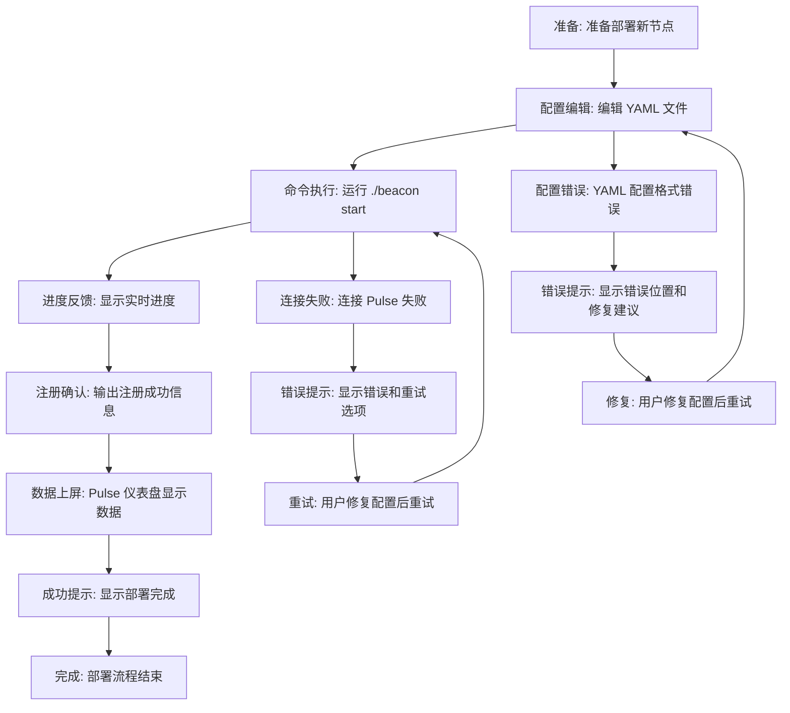
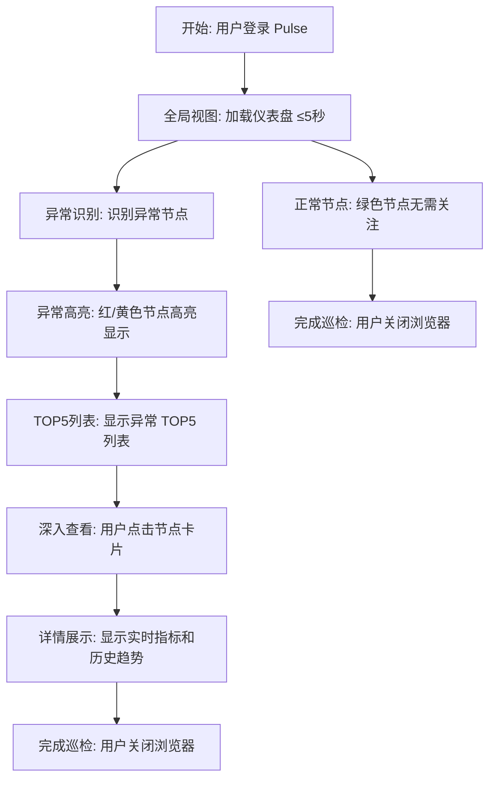
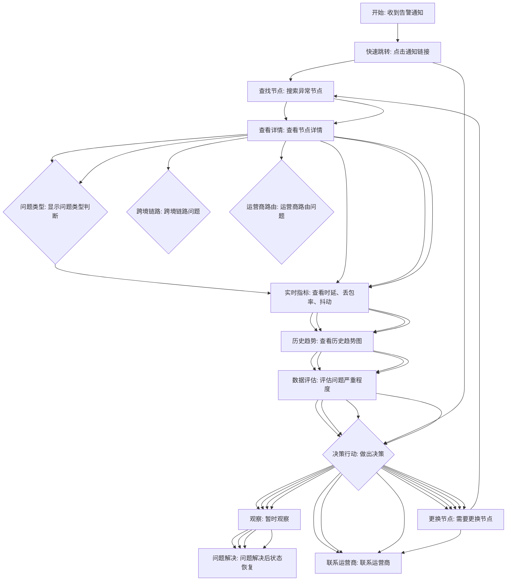

## User Journey Flows

### 旅程 1：Beacon 部署流程

**流程描述：** 运维工程师首次部署新的监控节点，从创建 YAML 配置到在 Pulse 仪表盘看到数据上屏的完整流程。

**流程图：**

**关键步骤说明：**

1. **配置编辑**：用户编辑 YAML 配置文件（node_id、node_name、pulse_server、probes）
   - 提供配置模板最小化字段，降低出错可能
2. **命令执行**：用户运行 `./beacon start`，CLI 开始启动流程
3. **进度反馈**：CLI 显示实时进度（"正在连接到 Pulse..."、"正在注册..."、"上传配置..."）
   - 让用户知道操作进展
4. **注册确认**：CLI 输出注册成功信息
   - `[INFO] Registration successful! Node ID: us-east-01`
   - Pulse 返回分配的节点 ID
5. **数据上屏**：用户登录 Pulse 仪表盘
   - 仪表盘加载 ≤5 秒
   - 节点状态从"未连接"（灰色）变为"在线"（绿色）
   - 开始显示第一个数据点
6. **成功提示**：显示"部署完成！用时 8 分钟"
   - 或显示"首次部署完成！"
   - 强化用户成就感
7. **完成旅程**：用户可以继续部署其他节点或进入日常使用

**成功标准：**
- 10 分钟内完成部署并看到第一个数据点上屏
- 用户感到成就感和掌控感

**错误处理路径：**
- **配置错误**：CLI 输出明确的错误位置和修复建议
  - 示例："配置格式错误：第 5 行缩进应为 2 个空格，实际是 4 个空格"
  - 用户可以快速修复并重试
- **连接失败**：CLI 输出连接失败信息
  - 示例："连接 Pulse 失败，请检查 pulse_server 地址"
  - 提供重试选项或稍后重试
- **注册失败**：CLI 输出注册失败原因
  - 示例："注册失败：节点 ID 已存在"
  - 用户可以修改 node_name 或 pulse_server 并重试

### 旅程 2：日常巡检流程

**流程描述：** 运维主管或工程师每日查看 Pulse 仪表盘，了解所有海外节点健康状态，识别异常节点，深入查看详情并评估问题。

**流程图：**

**关键步骤说明：**

1. **登录**：用户输入用户名密码，3 秒内进入仪表盘
2. **全局视图**：仪表盘加载 ≤5 秒
   - 显示所有节点卡片（红/黄/绿状态）
   - 显示异常 TOP5 列表
   - 显示核心指标均值（平均时延、平均丢包率）
3. **异常识别**：异常节点自动高亮（红色或黄色）
   - 用户一眼识别需要关注的节点
4. **深入查看**：用户点击节点卡片
   - 无需翻页，直接在当前页面展开详情
   - 显示节点详情：实时指标（时延、丢包率、抖动）、历史趋势图、问题类型判断
5. **问题评估**：用户查看实时指标、历史趋势图和 7 天基线参考线
   - 全面评估问题严重程度和影响范围
6. **完成巡检**：用户可以关闭浏览器或继续其他工作

**成功标准：**
- 仪表盘加载 5 秒内完成
- 用户一页看全所有节点状态
- 快速找到需要关注的节点

**错误处理路径：**
- **仪表盘加载失败**：显示错误提示和重试选项
  - 示例："仪表盘加载失败，请检查网络连接或稍后重试"
  - 用户可以刷新页面
- **节点详情加载失败**：显示错误提示
  - 示例："节点详情加载失败，请稍后重试"
  - 用户可以重新点击节点卡片

### 旅程 3：应急响应流程

**流程描述：** 运维主管收到 Webhook 告警通知，快速定位问题根源，做出决策（如更换节点、联系运营商）。

**流程图：**

**关键步骤说明：**

1. **入口点和触发器**：系统检测到网络指标超过阈值（如丢包率 > 30%、时延 > 1000ms）
   - 系统推送 Webhook 通知到用户（如钉钉消息）
   - 通知包含关键信息：异常节点名称、异常指标（当前值/阈值）
2. **通知接收**：运维主管收到 Webhook 通知
   - 快速了解问题发生
3. **快速跳转**：通知包含直接链接到异常节点详情页
   - 用户点击链接，直接跳转到 Pulse 仪表盘
   - 无需登录（如果会话未过期）或手动登录
4. **问题定位**：用户查看异常节点详情页
   - 顶部显示问题类型判断：
     - 节点本地故障
     - 跨境链路问题
     - 运营商路由问题
   - 系统自动判断，消除用户猜测
5. **数据评估**：用户查看实时指标、历史趋势图和 7 天基线参考线
   - 全面评估问题严重程度和影响范围
6. **决策行动**：用户基于数据做出决策
   - "需要更换节点"
   - "联系运营商"
   - "暂时观察"
7. **问题解决**：问题解决后，节点状态恢复正常（绿色）
   - 系统可能发送"问题已解决"的通知

**成功标准：**
- 从告警到完成问题定位 ≤5 分钟
- 用户准确理解问题根源
- 用户可以快速做出决策

**错误处理路径：**
- **Webhook 推送失败**：系统记录失败并尝试重试
  - 示例："Webhook 推送失败，已重试 3 次，请检查 URL 配置"
  - 系统可能在 Pulse 仪表盘显示失败状态
  - 用户可以检查 Webhook 配置
- **链接跳转失败**：通知链接无法直接跳转
  - 示例："链接已失效，请登录 Pulse 查看详情"
  - 用户需要手动登录 Pulse 并查找节点
- **节点详情加载失败**：显示错误提示
  - 示例："节点详情加载失败，请稍后重试"
  - 用户可以重新点击节点卡片

## 旅程模式提取

从以上三个旅程中，我识别出可重用的模式：

### 导航模式

- **侧边栏导航**：用于 Pulse Web 平台的主要模块切换
  - 左侧固定侧边栏（仪表盘、节点管理、告警配置、系统设置）
  - 符合运维人员使用习惯，易于扩展

- **状态指示器**：用于节点健康状态显示
  - 圆形指示器（绿/黄/红）直观表达状态
  - 快速识别异常节点

- **卡片展开详情**：用于节点详情查看
  - 点击节点卡片无需翻页直接展开详情
  - 减少点击次数，提高效率

### 决策模式

- **问题类型自动判断**：用于应急响应流程
  - 系统自动标注问题类型（节点本地/跨境链路/运营商）
  - 消除用户手动对比分析或猜测

- **进度可视化**：用于长时间操作（部署、配置更新）
  - 显示分步骤进度（1/4、2/4、3/4、4/4）
  - 用户始终知道操作进度，降低焦虑

### 反馈模式

- **Toast 通知**：用于操作成功或失败的即时反馈
  - 显示"节点添加成功"、"配置已保存"、"连接失败"
  - 短暂显示后自动消失，不阻塞界面

- **错误提示包含解决方案**：用于错误处理
  - 错误消息包含具体原因和修复建议
  - 示例："配置格式错误：第 5 行缩进应为 2 个空格，实际是 4 个空格"
  - 提供一键恢复或重试选项

- **进度总结**：用于关键任务完成后的肯定反馈
  - 显示"部署完成！用时 8 分钟"、"从告警到定位问题用时 4 分钟"
  - 强化用户成就感

## 流程优化原则

基于以上旅程设计，我定义以下优化原则：

**效率优化：**

- 最小化用户完成旅程所需的步骤数
- 所有关键信息最多 2 次点击可到达
- 减少页面加载时间（仪表盘 ≤5 秒）
- 提供快捷操作（如"重新部署"、"忽略告警"）

**认知负荷优化：**

- 使用用户熟悉的模式和术语（类似 Prometheus、Grafana）
- 保持视觉一致性（统一的颜色编码、状态指示器）
- 提供清晰的上下文和下一步操作建议

**愉悦时刻强化：**

- 首次操作提供特别提示和教程
- 关键任务完成后显示耗时统计和肯定反馈
- 鼓励用户分享成果（导出数据、截图分享）

**错误处理和恢复：**

- 明确的错误消息和恢复路径
- 提供一键恢复或重试选项
- 错误不归咎用户（"配置错误"而非"你配置错了"）
- 错误聚焦解决方案而非问题本身
