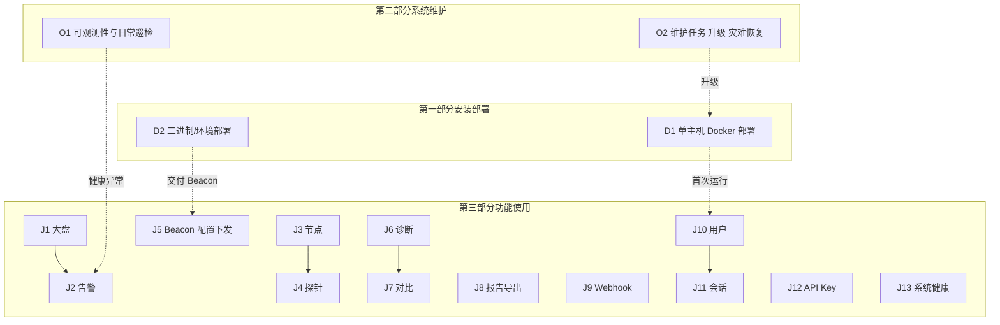
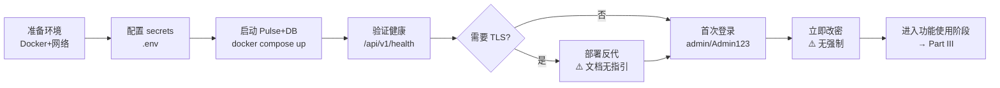
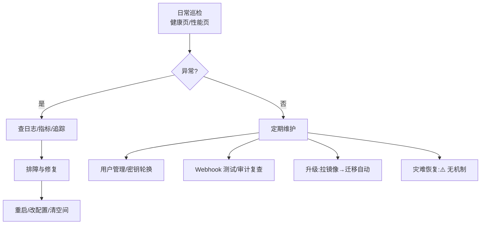
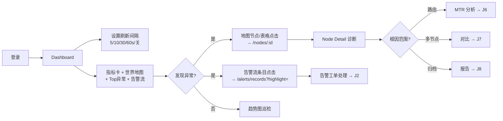
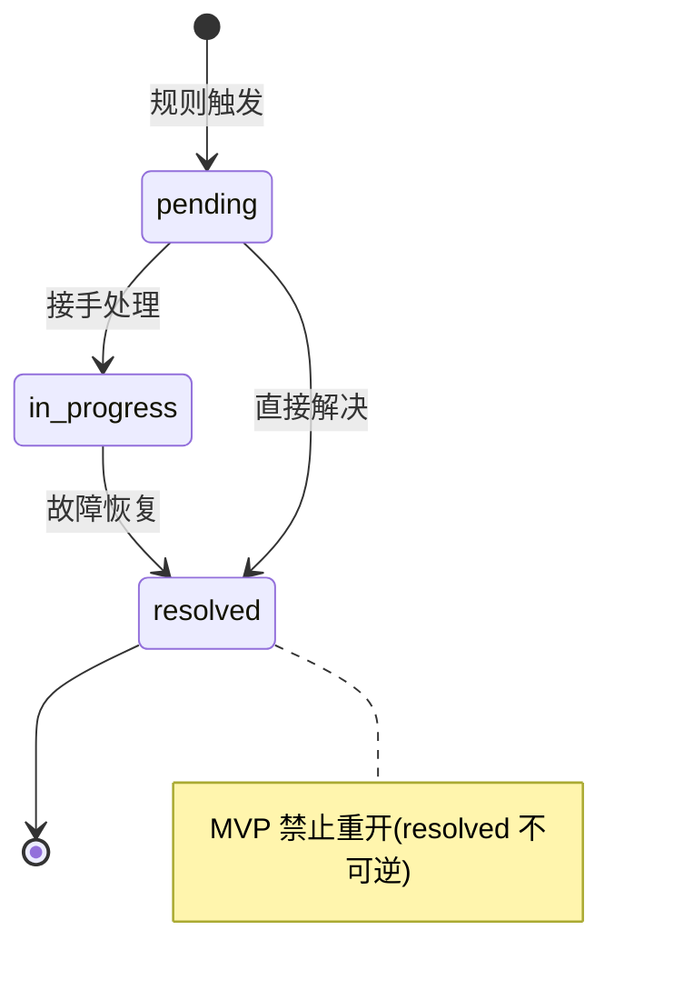

# NodePulse 用户旅程与操作流程

**Owner:** Kevin
**Date:** 2026-07-06
**Version:** 3.4
**Status:** 最终缺口清零 —— O-G5（优雅关闭超时可配 `server.shutdown_timeout_seconds`）+ O-G6（TrustedProxies `server.trusted_proxies` CIDR 列表）。§23 P0–P4 全部缺口已修复，无遗留项。

> 本文档从**使用者视角**系统拆解 NodePulse 的全部用户旅途与操作流程。
>
> v3.0 的核心变化：
> - **新增第一部分（安装部署）**：v2.x 完全空白，本文补齐 Deployer 视角的「从零到运行」全流程
> - **新增第二部分（系统维护与运维）**：v2.x 仅 J13 覆盖「看健康」，本文补齐 SRE/Admin 的日常运维、故障响应、升级、灾难恢复
> - **保留第三部分（功能使用）**：J1–J13 经 v2.4 勘误与代码验证后内容准确，原样保留
> - **缺口如实标注**：每个能力标明真实状态（[支持]/[部分支持]/[计划中]/[搁置]/**[未实现]**），不再有「文档谎称已实现」的情况
>
> 阅读建议：
> 1. 先看 §1 角色 → §2 三阶段全景 → §3 实现分层（理解每条旅程的真实可用性）
> 2. 按角色选读：Deployer → Part I（§4–§6）；SRE → Part II（§7–§9）；所有使用者 → Part III（§10–§22）
> 3. §23 缺口总表是排期与 backlog 的核心依据

---

## 目录

### 通用
- [1. 角色与约定](#1-角色与约定)
- [2. 用户旅程全景图（三生命周期）](#2-用户旅程全景图三生命周期)
- [3. 实现分层模型](#3-实现分层模型读懂本表--读懂旅程真实状态)

### 第一部分：安装部署（Deployer 视角）
- [4. 部署旅程总览](#4-部署旅程总览part-i)
- [5. D1 单主机 Docker 部署](#5-d1-单主机-docker-部署)
- [6. D2 二进制与环境部署 + 部署缺口清单](#6-d2-二进制与环境部署--部署缺口清单)

### 第二部分：系统维护与运维（SRE/Admin 视角）
- [7. 运维旅程总览](#7-运维旅程总览part-ii)
- [8. O1 可观测性与日常巡检](#8-o1-可观测性与日常巡检)
- [9. O2 维护任务与运维缺口清单](#9-o2-维护任务与运维缺口清单)

### 第三部分：系统功能使用（Admin/Operator/Viewer 视角）
- [10. J1 运维大盘巡检与下钻](#10-j1-运维大盘巡检与下钻)
- [11. J2 告警响应与工单协作](#11-j2-告警响应与工单协作)
- [12. J3 节点全生命周期管理](#12-j3-节点全生命周期管理)
- [13. J4 探针管理](#13-j4-探针管理)
- [14. J5 Beacon 部署与配置下发](#14-j5-beacon-部署与配置下发)
- [15. J6 网络诊断与 MTR 分析](#15-j6-网络诊断与-mtr-分析)
- [16. J7 多节点横向对比](#16-j7-多节点横向对比)
- [17. J8 报告生成与数据导出](#17-j8-报告生成与数据导出)
- [18. J9 Webhook 集成与治理](#18-j9-webhook-集成与治理)
- [19. J10 用户与权限管理](#19-j10-用户与权限管理)
- [20. J11 会话与自助安全](#20-j11-会话与自助安全)
- [21. J12 API Key 与服务账号管理](#21-j12-api-key-与服务账号管理)
- [22. J13 系统健康监控](#22-j13-系统健康监控)

### 总结
- [23. 实现断裂点总表（Implementation Gaps）](#23-实现断裂点总表implementation-gaps)
- [24. 跨角色协作剧本](#24-跨角色协作剧本)
- [25. 旅程—需求—状态对照总表](#25-旅程需求状态对照总表)
- [26. 异常流程与边界](#26-异常流程与边界)
- [27. 维护约定与变更历史](#27-维护约定与变更历史)

---

## 1. 角色与约定

### 1.1 用户角色（Personas）

NodePulse 面向海外基础设施的运维监控。结合 RBAC 实现
（`pulse/internal/auth/rbac.go`）与前端类型（`frontend/src/types/auth.ts:15`），
使用者归纳为六类角色。v3.0 在 v2.x 的 4 个使用角色基础上，**新增 2 个被 v2.x 遗漏的生命周期角色**：

| 角色 | 典型画像 | 核心诉求 | 系统边界 | v3.0 变化 |
|------|----------|----------|----------|----------|
| **Deployer（部署者）** | 平台工程师 / DevOps | 从零到运行：安装、首次配置、TLS、备份 | 仅在安装部署阶段介入；无日常 UI 角色 | 🆕 v3.0 新增 |
| **SRE / On-call（运维）** | SRE 工程师 | 系统健康、故障响应、容量、升级 | 系统层而非业务监控目标；偏运维 | 🆕 v3.0 新增 |
| **Admin（管理员）** | 平台负责人 / SRE 主管 | 全局可见、用户/集成/导出/系统管理 | 所有资源的全部动作；独占 users / webhooks / export / system:admin | 沿用 |
| **Operator（运维）** | 一线 on-call 工程师 | 快速定位故障、响应告警、配置探针 | 节点/探针/告警的增删改查；仅能改自己创建的资源（`CheckResourceOwnership`） | 沿用 |
| **Viewer（只读）** | 主管 / 跨团队协作方 | 查看大盘、告警、参与复盘 | 仅 view；无任何写操作 | 沿用 |
| **Beacon（探针服务）** | 运行在被监控节点的 agent | 上报心跳/指标/MTR、拉取配置 | 仅 `beacon:write`（心跳）+ `config:read`（拉配置）；不参与人类 UI | 沿用 |

> 前端**没有基于角色的路由守卫**（`App.tsx` 所有受保护路由一视同仁），角色限制在
> 各页面内部用 `user?.role === 'admin'` 等 `canEdit` 标志控制操作按钮可见性。
> 因此 Viewer 可以浏览所有页面 URL，但在写操作页会看到精简或只读界面。
> **注意**：`Reports.tsx` 的计划按钮曾遗漏角色关卡（见 §23 F1），v3.1 已修复（`isAdmin` 守卫创建/启用/删除）。

### 1.2 需求状态标签（沿用 PRD §2，v3.0 新增「未实现」）

- **[支持]** Supported — 端到端可用
- **[部分支持]** Partially supported — 有片段但流程未闭环或未达生产可用
- **[计划中]** Planned — 下一阶段规划
- **[搁置]** Deferred — 明确不在当前路线图
- **[未实现]** 🆕 Not implemented — 代码不存在；v3.0 引入以消除「文档谎称已实现」的误导

### 1.3 权限速查矩阵（摘自 `rbac.go:68-143`）

| 资源 | Admin | Operator | Viewer | Beacon |
|------|:-----:|:--------:|:------:|:------:|
| users | 全部 | — | — | — |
| nodes | 全部 | 全部（自己创建的） | view | — |
| probes | 全部 | 全部（自己创建的） | view | — |
| alerts | 全部 | 全部（自己创建的） | view | — |
| webhooks | 全部 | — | — | — |
| export | view/create | — | — | — |
| system | 全部 | view | view | — |
| config | view/update | — | — | read |
| beacon | read/write | read/write | — | write |

---

## 2. 用户旅程全景图（三生命周期）

v2.x 只覆盖了「功能使用」的 13 条旅程。v3.0 按系统生命周期拆为**三大阶段**，
共识别出 **5 条部署/运维旅程（D1–D2、O1–O2 含子旅程）+ 13 条功能旅程（J1–J13）**：



| 阶段 | 旅程 | 主角色 | 状态摘要 |
|------|------|--------|----------|
| **部署** | D1 单主机 Docker 部署 | Deployer | [支持]（TLS/备份缺口见 §6） |
| **部署** | D2 二进制/环境部署 | Deployer | [部分支持]（无 systemd/版本/TLS） |
| **运维** | O1 可观测性与日常巡检 | SRE | [支持]（指标/健康/追踪齐备） |
| **运维** | O2 维护任务/升级/灾难恢复 | SRE/Admin | [部分支持]（清理任务未接线、无备份、无升级文档） |
| **功能** | J1 运维大盘巡检与下钻 | Operator | [支持] |
| **功能** | J2 告警响应与工单协作 | Operator | [支持] |
| **功能** | J3 节点全生命周期管理 | Admin/Operator | [支持] |
| **功能** | J4 探针管理 | Admin/Operator | [支持] |
| **功能** | J5 Beacon 部署与配置下发 | DevOps | [支持] |
| **功能** | J6 网络诊断与 MTR 分析 | Operator | [支持] |
| **功能** | J7 多节点横向对比 | Operator | [支持] |
| **功能** | J8 报告生成与数据导出 | Admin | [支持] |
| **功能** | J9 Webhook 集成与治理 | Admin | [支持] |
| **功能** | J10 用户与权限管理 | Admin | [支持] |
| **功能** | J11 会话与自助安全 | 所有角色 | [支持] |
| **功能** | J12 API Key 与服务账号 | Admin | [支持] |
| **功能** | J13 系统健康监控 | Admin/Operator | [支持] |

---

## 3. 实现分层模型（读懂本表 = 读懂旅程真实状态）

NodePulse 存在大量**分层不完整**的能力 —— 后端实现了路由、甚至前端写了 API client
函数，但 UI 没有入口；或反之文档声称的能力代码不存在。本表用三层标记每个能力的真实状态：

| 层级 | 含义 | 标记 |
|------|------|------|
| **B** | Backend — 后端有路由/逻辑 | ✅ 有 / ❌ 无 / ⚠️ 部分 |
| **F** | Frontend API — 前端有 api client 函数 | ✅ 有 / ❌ 无 |
| **U** | UI — 前端页面有可见操作入口 | ✅ 有 / ❌ 无 / ⚠️ 孤儿组件 |

只有三层都是 ✅ 的能力，用户才真正可用。

### 3.1 部署/运维层能力快照（v3.0 新增）

| 能力 | B | F | U | 用户是否可用 | 说明 |
|------|:-:|:-:|:-:|:----------:|------|
| 单主机 Docker 部署 | ✅ | — | — | ✅ 可用 | `deploy/docker/docker-compose.prod.yml` |
| 自动迁移（前向） | ✅ | — | — | ✅ 可用 | 启动时 golang-migrate（0001–0005） |
| 管理员种子（idempotent） | ✅ | — | — | ✅ 可用 | bcrypt cost 12；仅首次插入 |
| 密钥自动生成（dev） | ✅ | — | — | ⚠️ 仅 dev | 生产必须显式设置，否则每次重启失效 |
| Pulse 健康端点 | ✅ | ✅ | ✅ | ✅ 可用 | `/api/v1/health` 探 DB/scheduler/告警引擎/webhook |
| Pulse Prometheus 指标 | ✅ | — | — | ✅ 可用 | `/metrics`（:6532） |
| Beacon Prometheus 指标 | ✅ | — | — | ✅ 可用 | `/metrics`（:2112） |
| OpenTelemetry 追踪 | ✅ | — | — | ✅ 可用（opt-in） | `telemetry.enabled` |
| 指标数据清理（保留 7 天） | ✅ | — | — | ✅ 可用 | `metrics-cleanup` 任务 |
| 优雅关闭 | ✅ | — | — | ✅ 可用 | SIGTERM 刷批处理 + drain（硬超时 10s） |
| **TLS 终止/证书供应** | ✅ | — | — | ✅ 可用（v3.2） | 经反代终止；`deploy/reverse-proxy/{nginx.conf,Caddyfile}` + `docs/deployment-tls.md` |
| **数据库备份/恢复** | ✅ | — | — | ✅ 可用（v3.2） | `deploy/backup/pg-backup.sh` + systemd timer；恢复见 `docs/operations.md §3` |
| **升级/回滚文档** | ✅ | — | — | ✅ 可用（v3.2） | `docs/upgrade.md`（前向迁移 + 三种回滚路径 + 兼容矩阵） |
| **Beacon systemd unit** | ✅ | — | — | ✅ 可用（v3.2） | `beacon/deploy/beacon.service` + `install-systemd.sh` + `make install-systemd` |
| **版本/发布系统** | ✅ | ✅ | — | ✅ 可用（v3.2） | Makefile ldflags 注入 `version` 包；`GET /api/v1/version` |
| **审计/会话/Token 清理** | ✅ | — | — | ✅ 可用（v3.1） | `auth-cleanup` 任务（`registry.go registerAuthCleanupTask`），包装 `auth.CleanupJob.RunAll` |
| **Pulse 配置热重载** | ✅ | — | — | ✅ 可用（v3.2，Phase 1） | SIGHUP 触发 `reloadConfig()`；当前覆盖 `log.level`（DB/端口/JWT 仍需重启） |
| **管理员解锁用户** | ✅ | ✅ | ✅ | ✅ 可用（v3.2） | `POST /admin/users/:id/unlock` + UsersPage「立即解锁」按钮 |
| **JWT 密钥轮换窗口** | ✅ | — | — | ✅ 可用（v3.2） | `JWTService.WithPreviousKey` + `PULSE_JWT_PREVIOUS_*` env，旧 key 过渡窗口 |

### 3.2 功能层能力快照（J1–J13，沿用 v2.4）

所有 13 条功能旅程的 B+F+U 三层均已闭环（v2.1–v2.4 修复成果），详见各旅程小节。
关键能力快照：

| 能力 | B | F | U | 用户是否可用 | 说明 |
|------|:-:|:-:|:-:|:----------:|------|
| 登录/登出/会话列表/吊销 | ✅ | ✅ | ✅ | ✅ 可用 | `/settings/sessions` |
| 告警状态流转 + 备注 | ✅ | ✅ | ✅ | ✅ 可用 | 桌面 Modal + 移动端 |
| 节点/探针/告警规则 CRUD | ✅ | ✅ | ✅ | ✅ 可用 | |
| Webhook CRUD + 测试 + 投递日志 | ✅ | ✅ | ✅ | ✅ 可用 | |
| Beacon 配置编辑/版本历史/回滚/模板 | ✅ | ✅ | ✅ | ✅ 可用 | |
| 报告 PDF/CSV + 计划 + 邮件 | ✅ | ✅ | ✅ | ✅ 可用 | 服务端调度 |
| 告警路由规则 | ✅ | ✅ | ✅ | ✅ 可用 | RouteMatcher 注入 |
| API Key 全套生命周期 | ✅ | ✅ | ✅ | ✅ 可用 | `/settings/api-keys` |
| 审计日志查询 | ✅ | ✅ | ✅ | ✅ 可用 | `/settings/audit-logs` |
| 密码自助修改 + 重置邮件 | ✅ | ✅ | ✅ | ✅ 可用 | |
| WebSocket 实时（含 node:online/offline） | ✅ | ✅ | ✅ | ✅ 可用（v2.4） | 心跳转换 + sweeper 广播 |
| **报告计划按钮角色关卡** | ✅ | ✅ | ⚠️ | ⚠️ Viewer 点会 403 | §23 F1，真实 bug |

> 这张表是排期的核心依据：U 列的每一个 ❌/⚠️ 都是一个用户可感知的缺口。

---

# 第一部分：安装部署（Deployer 视角）

> v2.x 完全缺失的部分。本部分覆盖「从零到运行」的全流程，主角色为 Deployer（平台/DevOps 工程师）。

## 4. 部署旅程总览（Part I）



## 5. D1 单主机 Docker 部署

> **对应 PRD NFR-2**。主角色：Deployer。这是**唯一开箱即用的生产部署方式**。

### 5.1 部署工件

| 工件 | 路径 | 用途 |
|------|------|------|
| 生产 compose | `deploy/docker/docker-compose.prod.yml` | Pulse（嵌入前端）+ Postgres，单容器两服务 |
| Pulse Dockerfile | `pulse/Dockerfile` | 3 阶段：前端构建 → Go 编译（含 Swagger）→ Alpine 运行时 |
| Beacon Dockerfile | `beacon/Dockerfile` | 2 阶段：静态 Go 二进制 → Alpine 运行时 |
| 环境模板 | `.env.example`（根） | Postgres + Pulse secrets + CORS + 遥测 |
| 配置模板 | `pulse/pulse.yaml.example` | 完整 schema 参考（非 compose 部署用） |

### 5.2 必填环境变量（fail-fast）

`docker-compose.prod.yml` 用 `${VAR:?...}` 强制以下 4 项必须设置，否则启动失败：

| 变量 | 用途 |
|------|------|
| `POSTGRES_PASSWORD` | 数据库密码 |
| `PULSE_ADMIN_PASSWORD` | 初始管理员密码（8–32 字符，含大小写+数字） |
| `PULSE_SESSION_SECRET` | Session 加密密钥（`openssl rand -hex 32`） |
| `PULSE_JWT_SECRET` | JWT 签名密钥（`openssl rand -hex 32`） |

> ⚠️ 若二进制部署（非 Docker）省略后两个 secret，**每次重启都会重新生成，导致所有 session/JWT 失效**。compose 的强制要求正是为此。

### 5.3 启动流程（自动发生）

1. `docker compose up -d --build` 构建并启动
2. Postgres 就绪（`pg_isready` 健康检查）
3. Pulse 启动 → `config.MustLoad()`（Viper 加载）→ 连接 DB → **自动迁移**（`0001`–`0005`）→ **种子管理员**（idempotent，仅首次插入）→ 启动调度器 + 节点状态 sweeper → 监听 :6532
4. Pulse 容器健康检查：`wget /api/v1/health`（10s 间隔）

### 5.4 验证

```bash
curl http://localhost:6532/api/v1/health   # 应返回 {"status":"healthy",...}
# 浏览器访问 http://localhost:6532 → 登录页
# 默认凭据：admin / 你在 .env 设置的 PULSE_ADMIN_PASSWORD
```

### 5.5 状态

- 单主机 Docker 部署 **[支持]**。
- 自动迁移、管理员种子、密钥生成（dev）、健康检查 **[支持]**。
- **TLS、备份、升级路径** 见 §6 缺口清单。

---

## 6. D2 二进制与环境部署 + 部署缺口清单

> 非 Docker 部署、Beacon 分发、以及部署阶段的全部缺口。

### 6.1 二进制部署（Docker 外）

```bash
# Pulse
cd pulse && make build        # 产出 bin/pulse-api
./bin/pulse-api               # 读 ./pulse.yaml 或 /etc/node-pulse/pulse.yaml

# Beacon（分发到被监控节点）
cd beacon && make build       # 产出 build/beacon（静态 Linux AMD64）
make install                  # cp 到 /usr/local/bin/beacon
beacon start                  # 读 ./beacon.yaml 或 BEACON_CONFIG_PATH
```

### 6.2 部署缺口清单（D 系列）

| # | 缺口 | 状态 | 后果 | 修复方向 |
|---|------|------|------|----------|
| **D-G1** | **无 TLS 终止/证书供应** | ✅ **[已修复 v3.2]** | ~~Pulse 监听明文 HTTP；文档与实现不符~~ → `docs/deployment-tls.md` + `deploy/reverse-proxy/{nginx.conf,Caddyfile}` |
| **D-G2** | **无数据库备份/恢复机制** | ✅ **[已修复 v3.2]** | ~~仅 `postgres_data` 卷，单点数据丢失~~ → `deploy/backup/pg-backup.sh` + systemd timer + `docs/operations.md §3` |
| **D-G3** | **无升级/回滚文档与流程** | ✅ **[已修复 v3.2]** | ~~升级靠盲操作~~ → `docs/upgrade.md`（三回滚路径 + 兼容矩阵） |
| **D-G4** | **Beacon 无服务管理（systemd）** | ✅ **[已修复 v3.2]** | ~~`make install` 仅拷贝二进制~~ → `beacon/deploy/{beacon.service,install-systemd.sh}` + `make install-systemd` |
| **D-G5** | **无版本/发布系统** | ✅ **[已修复 v3.2]** | ~~`service_version="unknown"`~~ → `pulse/internal/version` + `beacon/internal/version` + Makefile ldflags + `GET /api/v1/version` |
| **D-G6** | 根 `.env.example` 的 "Frontend (nginx)" 段是死引用 | ✅ **[已修复 v3.2]** | 已删除 `FRONTEND_PORT=80` 死引用段 |
| **D-G7** | 无「首次运行向导」/空态引导 | 🟡 体验 | 新 Admin 看到 0 节点空 Dashboard，无引导 | 空态 CTA + Getting Started 清单 |
| **D-G8** | README Quick Start 与 API Key 创建脱节 | 🟡 体验 | 步骤说「从 UI 生成 api_key」但不说在哪个页面（`/settings/api-keys`） | 交叉引用 |

### 6.3 状态

- 二进制构建与分发 **[支持]（v3.2 D-G4/G5 已修复：systemd unit + 版本系统）**
- 其余部署能力：D-G1~G6 已全部修复（v3.2），D-G7/G8 体验问题待处置

---

# 第二部分：系统维护与运维（SRE/Admin 视角）

> v2.x 仅 J13 覆盖「看健康」。本部分补齐 SRE/Admin 的日常运维、故障响应、升级、灾难恢复。

## 7. 运维旅程总览（Part II）



## 8. O1 可观测性与日常巡检

> **对应 PRD NFR-4**。主角色：SRE。这是 NodePulse **最完整**的运维维度。

### 8.1 可观测性三支柱

| 支柱 | Pulse | Beacon | 说明 |
|------|-------|--------|------|
| **日志** | slog → stdout（无轮换） | slog + lumberjack 文件轮换 | Pulse 需容器运行时管日志；Beacon 自管 |
| **指标** | `/metrics`（:6532） | `/metrics`（:2112） | 完整 Prometheus 目录见 `docs/observability.md` |
| **追踪** | OpenTelemetry（opt-in） | otelhttp 注入 traceparent | Beacon↔Pulse 端到端关联 |

### 8.2 健康端点（`GET /api/v1/health`，公开）

`pulse/internal/health/health.go` 探测：
- **数据库** — `pool.Ping`；nil DB 显示 `disabled`；失败 → `unhealthy`（503）
- **调度器** — `metrics-cleanup` 任务状态
- **告警引擎** — 5min 缓存陈旧 → `stale`；通道满 → `full`
- **Webhook 投递** — 近期成功率
- **告警抑制** — 活跃抑制计数

三态：`healthy`（200）/ `degraded`（200）/ `unhealthy`（503）。

### 8.3 前端运维仪表板

| 页面 | 路由 | 用途 | 轮询 |
|------|------|------|------|
| 系统健康 | `/integrations/health` | 综合状态 + 各子系统卡片 | 15s |
| 性能大盘 | `/performance` | P95/P99 趋势 + 异常列表 + P0/P1 Toast | 60s |
| 系统配置 | `/settings/system-config` | 只读配置 + 重新校验（admin） | 手动 |

### 8.4 日常巡检操作

| 步骤 | 操作 | 入口 | 角色 |
|------|------|------|------|
| 1 | 查看综合健康 | `/integrations/health` | Admin/Operator/Viewer |
| 2 | 查看 Webhook 成功率/告警抑制计数 | 健康页卡片 | Admin/Operator |
| 3 | 查看性能趋势/异常 | `/performance` | Admin/Operator/Viewer |
| 4 | 查看节点实时状态 | `/dashboard`（WS node:online/offline v2.4） | 所有 |
| 5 | 审计日志复查 | `/settings/audit-logs` | Admin |
| 6 | Prometheus 抓取 | 外部 Prometheus 抓 `/metrics` | SRE |

### 8.5 状态

- 指标、健康、追踪、前端仪表板 **[支持]**。
- Pulse 日志无原生轮换 **[部分支持]**（依赖容器运行时）。
- **未随仓库提供 `prometheus.yml`/告警规则/仪表板 JSON** —— `docs/observability.md` 有示例但 `deploy/` 未随附。

---

## 9. O2 维护任务与运维缺口清单

> 日常维护操作 + 运维阶段的全部缺口。

### 9.1 日常维护任务（Admin）

| 任务 | 入口 | 频率 | 状态 |
|------|------|------|------|
| 用户锁定排查 | `/settings/users` | 按需 | ✅（v3.2「立即解锁」按钮，O-G2）|
| API Key 轮换 | `/settings/api-keys` | 推荐 90 天 | ✅（旧 key 24h 过渡） |
| Webhook URL 变更 + 测试 | `/integrations/webhooks` | 按需 | ✅ |
| 审计日志复查 | `/settings/audit-logs` | 定期 | ✅ |
| 强制踢人 | `/settings/users` | 紧急 | ✅ |
| 配置变更（日志级） | 编辑 `pulse.yaml` → `kill -HUP <pid>` | 按需 | ✅（v3.2 O-G4，Phase 1：仅 log.level；DB/端口/JWT 仍需重启）|
| JWT 密钥轮换 | 设置 `PULSE_JWT_PREVIOUS_*` env → 重启 → 等过期 → 清空 → 重启 | 定期 | ✅（v3.2 O-G3，旧 key 过渡窗口）|
| Session 密钥轮换 | 改 env → **重启** | 定期 | ❌ 无并发旧+新验证窗口（仍需重启，所有 session 失效）|

### 9.2 数据保留与清理

| 任务 | 实现 | 状态 |
|------|------|------|
| 指标数据清理（保留 7 天） | `metrics-cleanup` 调度任务 | ✅ 运行 |
| 告警抑制清理 | `suppression-cleanup` 调度任务 | ✅ 运行 |
| 导出文件清理 | `cleanupOldExports` | ✅ 运行 |
| **审计/会话/Token/API Key 清理** | `auth-cleanup` 任务（包装 `auth.CleanupJob.RunAll`） | ✅ 运行（v3.1 接线，`registry.go registerAuthCleanupTask`） |

> v3.1 变更：原 O-G1 缺口（清理函数存在但未注册到 scheduler）已修复。`auth-cleanup` 任务由 `server/auth_cleanup_task.go` 适配 `auth.CleanupJob` 到 `scheduler.Task`，在 `registerAuthCleanupTask` 中注册，随 `cleanup.IntervalSeconds`（默认 86400s）节奏运行，覆盖 refresh_tokens / token_blacklist / rate_limits（24h）/ auth_audit_logs（90 天）/ expired_api_keys（30 天）。`authentication.md` 的「Audit Log Retention」段已同步为真实实现。

### 9.3 升级

| 步骤 | 操作 | 状态 |
|------|------|------|
| 1 | 拉新代码/镜像 | `docker compose up -d --build` |
| 2 | 迁移自动前向跑 | ✅ 启动时 `golang-migrate` |
| 3 | 验证健康 | `curl /api/v1/health` |
| 回滚 | 手动 `make migrate-down` | ⚠️ 需外部 CLI，无生产指引 |

### 9.4 故障响应（已知场景）

| 故障 | 系统行为 | 恢复 |
|------|----------|------|
| DB 不可达 | Pulse 启动进入 DEGRADED MODE（nil DB），`/health` 显示 `database:disabled` | 恢复 DB → 重启 |
| Beacon 无法连 Pulse | 心跳重试（reconnect 配置）+ PriorityCache 本地持久化 | 网络恢复后断点续传 |
| 节点超时（5min） | NodeStatusSweeper 标 offline + 广播 node:offline（v2.4） | 节点恢复心跳 → 广播 node:online |
| 磁盘满 | 无显式处理；审计/会话表曾无限增长（v3.1 O-G1 已修复，现在有 `auth-cleanup` 任务定期清理） | — |
| 优雅关闭 | SIGTERM → 停 cache/BatchWriter（刷批）→ 停 NodeStatusSweeper → 停 scheduler → HTTP drain（`server.go:70-97`，硬超时 10s 不可配，见 O-G5） | — |

### 9.5 运维缺口清单（O 系列）

| # | 缺口 | 状态 | 后果 | 修复方向 |
|---|------|------|------|----------|
| **O-G1** | **审计/会话/Token 清理未接线** | ✅ **[已修复 v3.1]** | ~~`auth_audit_logs`/`sessions`/`refresh_tokens`/`api_keys` 表无限增长~~；v3.1 起 `auth-cleanup` 任务注册到 scheduler | v3.1：`registry.go registerAuthCleanupTask` 包装 `auth.CleanupJob` |
| **O-G2** | **无管理员「解锁用户」** | ✅ **[已修复 v3.2]** | ~~被锁用户必须等 10 分钟或 DB 干预~~ → `POST /admin/users/:id/unlock` + UI「立即解锁」按钮 |
| **O-G3** | **无 JWT 轮换窗口** | ✅ **[已修复 v3.2]** | ~~轮换即全员 token 失效~~ → `JWTService.WithPreviousKey` + `PULSE_JWT_PREVIOUS_*` env，旧 key 过渡窗口 |
| **O-G4** | **Pulse 无热重载** | ✅ **[已修复 v3.2，Phase 1]** | ~~改配置需重启~~ → SIGHUP 触发 `reloadConfig()`，当前覆盖 `log.level`（DB/端口/JWT 仍需重启） |
| **O-G5** | 优雅关闭硬超时 10s 不可配置 | ✅ **[已修复 v3.4]** | ~~大批量刷写/长导出可能被截断~~ → `server.shutdown_timeout_seconds` 可配（默认 10） |
| **O-G6** | 无 TrustedProxies 配置 | ✅ **[已修复 v3.4]** | ~~反代后 `ClientIP()`/审计 IP 错误~~ → `server.trusted_proxies` CIDR 列表，builder 调 `SetTrustedProxies` |
| **O-G7** | 无运维 runbook/故障排查文档 | ✅ **[已修复 v3.2]** | ~~运维知识分散在 8+ 文档/代码~~ → `docs/operations.md` 集中（健康分级、事故剧本、备份恢复、配置变更） |
| **O-G8** | 未随仓库提供 Prometheus/仪表板配置 | 🟡 体验 | `docs/observability.md` 有示例但 `deploy/` 无随附 | 提供可应用的 `prometheus.yml` + 仪表板 JSON |

### 9.6 状态

- 可观测性、健康端点、优雅关闭、指标清理 **[支持]**。
- **清理任务接线**：✅ 已修复（v3.1，O-G1）。
- **备份、升级文档、运维 runbook、TLS、解锁用户、JWT 轮换、热重载**：✅ 已修复（v3.2，D-G1~G6、O-G2/G3/G4/G7）。
- **通知偏好、2FA、Prometheus 配置、关闭超时、TrustedProxies**：✅ 已修复（v3.3/v3.4，F3/F4/F5/O-G8/O-G5/O-G6）。
- §23 P0–P4 全部缺口已清零。

---

# 第三部分：系统功能使用（Admin/Operator/Viewer 视角）

> v2.x 已覆盖且经 v2.4 勘误与代码验证的 13 条功能旅程。本部分正文沿用 v2.x，并修正 v2.x 未回写的过时"断裂"描述（v2.1–v2.4 已修复的项标为 ✅）。

## 10. J1 运维大盘巡检与下钻

> **对应 PRD §4.1**。主角色：Operator；Admin、Viewer 可读。

### 10.1 旅程图



### 10.2 操作步骤

| 步骤 | 操作 | 入口 / 路由 | 角色 |
|------|------|-------------|------|
| 1 | 登录 | `/login` → `/dashboard` | 所有 |
| 2 | 设置自动刷新间隔（5/10/30/60s/关） | Dashboard 顶部下拉 | 所有 |
| 3 | 手动刷新 | Dashboard 刷新按钮（并发拉 nodes+metrics，5s 轮询，4 次失败退避 60s） | 所有 |
| 4 | 浏览指标卡 + 世界地图 + Top 异常 | Dashboard | 所有 |
| 5 | 浏览告警流（WebSocket 实时） | Dashboard `AlertStream`，断线轮询兜底 | 所有 |
| 6 | 地图节点点击下钻 | `WorldMap.onNodeClick` → `/nodes/:id` | 所有 |
| 7 | 告警条目点击 | `AlertStream` → `/alerts/records?highlight=<id>` | 所有 |

### 10.3 系统行为

- 大盘走 **内存环形缓冲缓存**（每节点 60 点），常态 < 300ms。
- 告警流走 **WebSocket**，前端消费 `alert:new`/`alert:updated`/`alert:resolved` 三个事件（`useGlobalRealtime.ts:48-89`）。后端额外广播 `alert:note_created`（`hub.go:149-158`），但前端目前**不消费**该事件（备注通过备注接口的响应或重新拉取记录刷新，不依赖 WS）。30s ping、断线指数退避重连（1s×2，上限 30s）。
- **全局通知层（v2.3）**：`AppLayout` 持有 `useGlobalRealtime` 单例，所有受保护页面生效浏览器通知。
- **节点上下线实时事件（v2.4）**：心跳到达转换 → 广播 `node:online`；sweeper 超时 → 广播 `node:offline`；前端 `useGlobalRealtime` 实时更新 `nodesStore`。

### 10.4 状态

- 大盘四件套、下钻、WebSocket 告警流、轮询兜底、全局通知、节点实时状态 **[支持]**。

---

## 11. J2 告警响应与工单协作

> **对应 PRD §4.2**。主角色：Operator；Viewer 可读。系统中**数据模型最复杂**的旅程。

### 11.1 告警状态机（`alert_record.go:64-80`）



### 11.2 操作步骤

| 步骤 | 操作 | 入口 | 权限 | 状态 |
|------|------|------|------|------|
| 1 | 发现告警（告警流或 `/alerts/records`） | Dashboard / `/alerts/records` | view | ✅ |
| 2 | 多维筛选（搜索/节点/时间/级别/状态） | `AlertRecordsFilter` | view | ✅ |
| 3 | 排序、分页 | 表头点击 | view | ✅ |
| 4 | 导出当前告警为 CSV | `/alerts/records` 顶部按钮 | view | ✅ |
| 5 | 打开告警详情 Modal | "查看详情" | view | ✅ |
| 6 | 查看统一时间线（创建/状态变更/备注） | `AlertRecordDetailModal` timeline | view | ✅ |
| 7 | 更新状态（接手/解决） | Modal 内按钮；后端 `models.CanTransitionTo`（`alert_record.go:64-80`）校验，前端镜像纯函数 `isValidStatusTransition`（`api/alertRecords.ts:106`） | admin/operator | ✅ |
| 8 | **添加调查备注** | `AlertRecordDetailModal` 输入框 + Ctrl/Cmd+Enter | admin/operator | ✅（v2.1 修复） |
| 9 | 从详情跳转节点 | "查看节点" → `/nodes/:id` | view | ✅ |
| 10 | 在 `/alerts/history` 行内流转状态 | `/alerts/history` | admin | ✅ |
| 11 | 移动端告警详情（含备注输入） | `AlertDetailMobile`（isMobile 门控） | admin/operator | ✅（v2.2 接入） |

### 11.3 状态

- 告警创建、状态流转、时间线查看、备注新增、WebSocket 推送、移动端 **[支持]（v2.1/v2.2 全部修复）**。

---

## 12. J3 节点全生命周期管理

> 主角色：Admin（全权）、Operator（自己创建的）。

### 12.1 操作步骤

| 步骤 | 操作 | 入口 | 权限 |
|------|------|------|------|
| 1 | 查看节点列表 | `/nodes` | view（所有角色） |
| 2 | 点击节点名 → 详情 | `/nodes/:id` | view |
| 3 | 创建节点 | `NodeDialog` | admin/operator（前端 `canEdit = role==='admin' \|\| role==='operator'`） |
| 4 | 编辑/删除节点 | Dialog / AlertDialog | admin/operator |

> 前后端 RBAC 已对齐：前端 `NodeManagementPage.tsx:34-36` 现将 `canEdit` 设为 `admin || operator`（注释保留历史：此前曾错误地对 operator 隐藏，已修复），后端 `routes.go:379,382,385,388` 通过 `RBACMiddleware(["admin","operator"])` 守护 POST/PUT/DELETE。Operator 能看到创建/编辑/删除按钮。

### 12.2 状态

[支持]（v3.1 勘误：前后端 RBAC 已对齐为 admin+operator；此前的「Operator UI 入口隐藏」描述为已修复的旧行为）。

---

## 13. J4 探针管理

> 主角色：Admin/Operator。

### 13.1 操作步骤

按节点筛选 → 创建/编辑/删除探针（TCP/UDP，MTR 走 Beacon 配置）。前端 `ProbeManagementPage.tsx:48-50` 已有显式 UI 关卡 `canEdit = admin || operator`（注释：「gate the UI so viewers don't trigger 403s on click」），Viewer 点不到写按钮；后端 `routes.go:407` 通过 `RBACMiddleware(["admin","operator"])` 守护。

### 13.2 状态

[支持]（v3.1 勘误：前端已加 admin/operator UI 关卡，Viewer 不再触发 403；此前的「前端缺少角色关卡」描述为已修复的旧行为）。

---

## 14. J5 Beacon 部署与配置下发

> 主角色：DevOps 工程师 + Beacon 服务账号。分 standalone 与 registered 两模式。

### 14.1 Beacon CLI（`beacon/internal/cli/`）

| 命令 | 作用 |
|------|------|
| `beacon start` | 启动 agent（加载→校验→探针调度→热重载→资源监控→Prometheus→registered 鉴权+心跳+配置同步+MTR） |
| `beacon stop` | 优雅停止（读 PID→SIGTERM→等 30s） |
| `beacon status` | JSON 状态（node_id/PID/running） |
| `beacon debug` | 诊断快照（网络/配置/资源/探针/Prometheus）；`--pretty` 人类可读 |

信号：SIGINT/SIGTERM → 优雅关闭；**SIGHUP → 配置热重载**。

### 14.2 前端配置下发（`/beacons/config`）

| 步骤 | 状态 |
|------|------|
| 选择节点、编辑配置、保存版本 | ✅ |
| 查看 Ack 状态徽章 | ✅ |
| 版本历史 + **回滚按钮** | ✅（v2.3 回滚落地） |
| 配置预览 | ✅（v2.2） |
| 分组批量下发 | ✅（v2.2） |
| 配置模板（服务端 CRUD） | ✅（v2.3，ADR-003） |

### 14.3 Beacon 运行时特性（v2.2 全部接线）

- **降级模式状态机**（G16）：`ModeManager` 接入 `start.go`，心跳失败驱动降级指标
- **压缩传输**（G17）：`SendCompressedHeartbeat`，`{data: base64(gzip), checksum: crc32}` → `/heartbeat/compressed`
- **失败心跳持久化/续传**（G18）：`PriorityCache` 缓存 + 启动 `load()` 恢复 + 关闭 `Persist()` 落盘
- **reconnect 配置**（G19）：`WithReconnectConfig` 接入 `reportWithRetry`，零值回退默认

### 14.4 状态

[支持]（v2.2 运行时接线 + v2.3 回滚/模板，全部闭环）。

---

## 15. J6 网络诊断与 MTR 分析

> 主角色：Operator。

### 15.1 操作步骤

节点详情 → 实时指标卡（5s 轮询）→ 趋势图（24h/7d/30d）→ 问题诊断（owner 归因）→ MTR 路径 → 历史快照 → 诊断报告。**交互式路径风险详情**（`MTRPathVisualization`）已接入（v2.2 G21）。

### 15.2 状态

[支持]。

---

## 16. J7 多节点横向对比

> 主角色：Operator。对应 PRD §4.4。

多选节点（2–5 个）→ 分组方式 → 时间范围 → 指标 → `ComparisonChart` → 服务端诊断（≥3 节点自动拉取）。

### 16.1 状态

[支持]。

---

## 17. J8 报告生成与数据导出

> 主角色：Admin（导出仅 Admin）。

### 17.1 操作步骤

| 步骤 | 状态 |
|------|------|
| 选报告类型 + 多选节点 + 日期 + 格式 CSV/PDF | ✅ |
| PDF 预览 Dialog → 打印 | ✅ |
| CSV 导出任务（持久化，v2.1 G3）→ 轮询 → 下载 | ✅ |
| 导出历史（过滤/分页/下载/删除） | ✅ |
| **报告计划 schedule**（每天/周/月）→ 服务端调度 + PDF/CSV + SMTP 邮件 | ✅（v2.3，ADR-001） |
| XLSX 导出 | ❌ 禁用（计划中） |

### 17.2 状态

[支持]（v2.1 持久化 + v2.3 计划+邮件+PDF，ADR-001）；XLSX 仍计划中。

---

## 18. J9 Webhook 集成与治理

> 主角色：Admin（唯一可管理）。对应 PRD §4.5。

### 18.1 操作步骤

| 步骤 | 状态 |
|------|------|
| CRUD（URL 必须 https + SSRF 校验） | ✅ |
| 预览 payload + 测试投递 + 启用切换 | ✅ |
| **投递日志查询**（`GET /webhooks/:id/logs` + Dialog） | ✅（v2.1 G4） |
| **告警路由规则**（`alert_routing_rules` + RouteMatcher 注入） | ✅（v2.3，ADR-002） |
| **严重级别过滤**（`rule.Severities` 匹配 `event.Level`，ADR-002 Tier 1） | ✅（`router.go:66-86`） |
| 自定义 headers（`Webhook` 结构无 Headers 字段） | ❌ 计划中 |

### 18.2 状态

[支持]（v2.1 投递日志 + v2.3 路由规则）。

---

## 19. J10 用户与权限管理

> 主角色：Admin（独占）。

用户列表（状态/角色/锁定徽章）→ CRUD → 行内角色变更（自己禁用）→ 删除（自己禁用）。无显式"激活/停用"开关；锁定由 5 次失败→10 分钟机制驱动。双重角色体系并存（字符串枚举 vs RBAC 表，后者未打通）。

### 19.1 状态

[支持]；自定义角色/细粒度权限未展开。

---

## 20. J11 会话与自助安全

> 主角色：所有角色（管理自己）。

### 20.1 操作步骤

| 步骤 | 状态 |
|------|------|
| 登录（5 次/分钟限流；5 次失败锁 10 分钟） | ✅ |
| 会话列表 + 单会话吊销 + 跨 tab 同步 | ✅ |
| **吊销自己所有会话** | ✅（v2.1 G10） |
| **修改自己密码** | ✅（v2.1 G5，PreferencesPage Security Card） |
| **密码重置邮件**（SMTP） | ✅（v2.3，`/forgot-password`+`/reset-password` 页面 + 后端 API） |
| **管理员强制踢人** | ✅（v2.1 G7） |
| 主题/语言/时区偏好 | ✅ |

### 20.2 状态

[支持]（v2.1 改密/吊销 + v2.3 重置邮件，全部闭环）。

---

## 21. J12 API Key 与服务账号管理

> 主角色：Admin。

API Key 全套生命周期（list/get/create/rotate/revoke），前端 v2.1 已补齐完整 UI。轮换时旧 key 24h 过渡（零停机）。`api_keys` 表 XOR 约束归属 user 或 service_account。**审计日志查询**是独立的 `/settings/audit-logs` 全局页面（`AuditLogsPage`，按时间/用户/事件筛选），并非嵌在 API Key 详情里查询单个 key 的操作历史。

### 21.1 状态

[支持]（v2.1 G2/G6）。

---

## 22. J13 系统健康监控

> 主角色：Admin/Operator。

### 22.1 操作步骤

| 步骤 | 入口 |
|------|------|
| 综合健康（DB/scheduler/告警子系统，healthy/degraded/unhealthy） | `/integrations/health`，15s 轮询 |
| 告警系统详情（引擎状态/缓存规则/通道深度/webhook 成功率/抑制计数） | 卡片 |
| 性能大盘（P95/P99 趋势/异常/P0·P1 Toast） | `/performance`，60s 轮询 |
| 系统配置只读 + 重新校验 | `/settings/system-config`（admin） |

### 22.2 状态

[支持]。

---


## 23. 实现断裂点总表（Implementation Gaps）

v3.0 合并三大生命周期的全部缺口，按严重度分级。处置标记：
- **【已修复】** — 端到端闭环（v2.1–v2.4 完成）
- **【未实现】** — 代码不存在；🆕 v3.0 引入以消除「文档谎称」
- **【文档谎称】** — 文档声称已实现但代码不存在（最高优先级修正）
- **待处置** — 暂未处理

### 23.1 P0 — 数据安全 / 合规 / 真实 bug（必须修）

| # | 缺口 | 类别 | 状态 | 后果 | 修复方向 |
|---|------|------|------|------|----------|
| **O-G1** | 审计/会话/Token 清理未接线 | 运维 | ✅ **【已修复 v3.1】** | ~~`auth_audit_logs`/`sessions`/`refresh_tokens` 无限增长~~；v3.1 起 `auth-cleanup` 任务注册到 scheduler | v3.1：`registry.go registerAuthCleanupTask` + `auth_cleanup_task.go` + 修正 `authentication.md` |
| **D-G2** | 无数据库备份/恢复 | 部署 | ✅ **【已修复 v3.2】** | ~~单卷单点失败；数据丢失不可恢复~~；v3.2 `deploy/backup/pg-backup.sh` + systemd timer + `docs/operations.md §3` 恢复 runbook |
| **F1** | `Reports.tsx` 计划按钮无角色关卡 | 功能 | ✅ **【已修复 v3.1】** | ~~非管理员看到按钮→点→403~~；v3.1 起 `isAdmin` 守卫创建/启用/删除 | v3.1：`Reports.tsx` 用 `useAuthStore().role` 守卫所有 schedule 写操作 |

### 23.2 P1 — 生产可用性（应优先）

| # | 缺口 | 类别 | 状态 | 后果 |
|---|------|------|------|------|
| **D-G1** | 无 TLS 终止/证书 | 部署 | ✅ **【已修复 v3.2】** | ~~文档说「TLS 1.2+」实际明文 HTTP~~；v3.2 提供 nginx/Caddy 反代参考 + `docs/deployment-tls.md` |
| **D-G3** | 无升级/回滚文档 | 部署 | ✅ **【已修复 v3.2】** | ~~升级盲操作~~；v3.2 `docs/upgrade.md` 三种回滚路径 + 兼容矩阵 |
| **O-G7** | 无运维 runbook | 运维 | ✅ **【已修复 v3.2】** | ~~运维知识分散 8+ 文档~~；v3.2 `docs/operations.md` 集中 |
| **O-G2** | 无管理员解锁用户 | 运维 | ✅ **【已修复 v3.2】** | ~~被锁用户等 10 分钟或改库~~；v3.2 `POST /admin/users/:id/unlock` + UI 按钮 |
| **F2** | 无集中式 RBAC 路由守卫 | 功能 | ✅ **【已修复 v3.2】** | ~~各页分散 `role===` 检查易漏~~；v3.2 `RequireRole` 组件守卫 5 个 admin-only 页面 |

### 23.3 P2 — 完善性 / 体验

| # | 缺口 | 类别 | 状态 |
|---|------|------|------|
| **D-G4** | Beacon 无 systemd unit | 部署 | ✅ **【已修复 v3.2】** —— `beacon/deploy/beacon.service` + `install-systemd.sh` + `make install-systemd` |
| **D-G5** | 无版本/发布系统 | 部署 | ✅ **【已修复 v3.2】** —— `pulse/internal/version` + `beacon/internal/version` + Makefile ldflags 注入 + `GET /api/v1/version` |
| **O-G3** | 无 JWT 轮换窗口 | 运维 | ✅ **【已修复 v3.2】** —— `JWTService.WithPreviousKey` + `JWTConfig.Previous*` 字段 + `PULSE_JWT_PREVIOUS_*` env |
| **O-G4** | Pulse 无热重载 | 运维 | ✅ **【已修复 v3.2，Phase 1】** —— SIGHUP 触发 `server.reloadConfig()`，当前覆盖 `log.level`（其他配置仍需重启） |
| **F3** | Viewer 无只读 Webhook/导出视图 | 功能 | ✅ **【已修复 v3.3】** —— Webhooks 由 v3.2 `RequireRole` 守卫；Reports 页 `ReportGenerator` 也对非 admin 显示 admin-only 提示而非 403 按钮 |
| **F4** | 无通知偏好/多通道 | 功能 | ✅ **【已修复 v3.3，Phase 1】** —— 用户级浏览器通知偏好（总开关 + 最低告警级别过滤 + 节点上下线开关），localStorage 持久化；服务端 per-user 邮件/多通道路由仍为未来扩展 |
| **F5** | 无 2FA/MFA | 功能 | ✅ **【已修复 v3.3】** —— TOTP 2FA 全链路（`MFAService` + `/auth/login/mfa` + `/auth/mfa/{setup,verify,disable,status}` + 登录二步 UI + PreferencesPage 管理卡片） |
| **O-G8** | 未随附 Prometheus/仪表板配置 | 运维 | ✅ **【已修复 v3.3】** —— `deploy/observability/{prometheus.yml,pulse-alerts.yml}` 可直接应用，含告警规则 |

### 23.4 P3 — 文档勘误

| # | 缺口 | 状态 |
|---|------|------|
| **F7** | `architecture.md`/`ui-design.md` 路由表过时（仅 3 个 `/settings/*`，实际 6 个） | ✅ 已修复（v3.3）|
| **F8** | `prd.md:297` 引用 `docs/iteration-roadmap.md`（不存在） | ✅ 已修复（v3.3，改为指向 user-journey §23 + iteration-plan 系列）|
| **D-G6** | 根 `.env.example` 的 "Frontend (nginx)" 段是死引用 | ✅ 已修复（v3.2）|

### 23.5 已修复（v2.1–v2.4，历史记录）

G1 告警备注、G2 API Keys 页、G3 导出持久化、G4 Webhook 投递日志、G5 改密、G6 审计日志页、G7 强制登出、G8 配置预览、G9 批量下发、G10 批量吊销、G11 系统配置页、G16-G19 Beacon 运行时接线、G20/G21 孤儿接入、G22-G24 死代码清理 —— 全部 **【已修复】**。

---

## 24. 跨角色协作剧本

### 24.1 剧本 A：跨境延迟突增（故障响应）

| 时序 | 角色 | 动作 | 旅程 |
|------|------|------|------|
| T0 | Beacon | 心跳上报高延迟 | J5 |
| T1 | Pulse | 告警引擎评估触发规则 | J2 |
| T2 | Pulse | 创建 alert_record + suppression | J2 |
| T3 | Pulse | Webhook 推送 + WS alert:new | J9/J1 |
| T4 | Operator | Dashboard 告警流/浏览器通知收到 | J1 |
| T5 | Operator | 接手 → in_progress | J2 |
| T6 | Operator | 下钻 Node Detail，看 MTR 与诊断 | J6 |
| T7 | Operator | 多节点对比判定跨境 | J7 |
| T8 | Operator | 加调查备注 | J2（v2.1 已修复） |
| T9 | Operator | 生成报告 PDF 归档 | J8 |
| T10 | Operator | 解决 → resolved | J2 |

### 24.2 剧本 B：新节点上线（部署流水）

| 时序 | 角色 | 动作 | 旅程 |
|------|------|------|------|
| T0 | Deployer | 部署 Pulse + DB（D1） | 部署 |
| T1 | Admin | 首次登录改密 | J11 |
| T2 | Admin | 创建 API Key | J12 |
| T3 | Admin | 创建节点 + 配置探针 | J3/J4 |
| T4 | DevOps | 编写 beacon.yaml（含 api_key）→ beacon start | J5 |
| T5 | Beacon | API Key 换 JWT + 心跳 + 拉配置 + Ack | J5 |
| T6 | Operator | Dashboard 看到新节点上线（WS node:online） | J1 |

### 24.3 剧本 C：灾难恢复（⚠️ 当前不可行）

| 时序 | 角色 | 动作 | 状态 |
|------|------|------|------|
| T0 | SRE | 发现数据损坏/丢失 | — |
| T1 | SRE | 尝试恢复 | ❌ **无备份机制（D-G2）** |
| T2 | SRE | 唯一选项：外部 pg_restore | ⚠️ 未文档化 |

---

## 25. 旅程—需求—状态对照总表

| 旅程 | 关键能力 | PRD FR/NFR | 整体状态 | 主要缺口（见 §23） |
|------|----------|-----------|----------|--------------------|
| D1 Docker 部署 | 单主机栈、自动迁移、密钥生成、TLS、备份 | NFR-2 | **[支持]** | TLS/备份已修复（v3.2 D-G1/G2） |
| D2 二进制部署 | 构建、分发、systemd、版本系统 | NFR-2 | **[支持]** | systemd/版本已修复（v3.2 D-G4/G5） |
| O1 可观测性 | 日志/指标/健康/追踪 | NFR-4 | **[支持]** | Pulse 日志无轮换 |
| O2 维护 | 清理/升级/备份/解锁/轮换/热重载 | NFR-2/6 | **[支持]** | O-G1/G2/G3/G4/G7 已修复（v3.1+v3.2）；余 O-G5/G6/G8 |
| J1 大盘 | 大盘四件套、下钻、WS、全局通知、节点实时 | FR-3 | **[支持]** | — |
| J2 告警 | 创建/状态/时间线/备注/路由 | FR-4 | **[支持]** | — |
| J3 节点 | CRUD、详情 | FR-3 | **[支持]** | Operator UI 入口 |
| J4 探针 | CRUD | FR-3 | **[支持]** | 角色关卡 |
| J5 Beacon | 双模式/心跳/Ack/版本/回滚/模板/压缩/续传/降级 | FR-1 | **[支持]** | — |
| J6 诊断 | 指标/MTR/诊断/路径风险 | FR-2 | **[支持]** | — |
| J7 对比 | 多节点对比 | FR-3 | **[支持]** | — |
| J8 报告 | PDF/CSV/历史/计划/邮件 | FR-5 | **[支持]** | XLSX 计划中 |
| J9 Webhook | CRUD/预览/测试/投递日志/路由 | FR-4 | **[支持]** | — |
| J10 用户 | CRUD/角色/强制登出 | FR-6 | **[支持]** | 自定义角色未展开 |
| J11 会话 | 登录/列表/吊销/改密/批量/重置邮件 | FR-6 | **[支持]** | — |
| J12 API Key | 全套生命周期 + 审计 | FR-6 | **[支持]** | — |
| J13 健康 | 综合健康/性能大盘 | NFR-4 | **[支持]** | — |

---

## 26. 异常流程与边界

### 26.1 认证与会话异常

- **登录失败**：5 次/分钟/IP 限流；账户 5 次失败锁 10 分钟。
- **Access 过期**：Axios 401 拦截器静默刷新；失败跳登录。
- **跨 tab 登出**：localStorage 广播同步。
- **StrictMode 双触发**：`useRef` 守卫会话恢复。

### 26.2 数据上报异常（Beacon）

- **Pulse 不可达**：心跳重试由 `reconnect` 配置驱动（默认 3 次指数退避）；**失败 payload 本地持久化**（v2.2 PriorityCache）+ 断点续传。
- **JWT 401**：自动失效 token 并重换。
- **节点超时**：`NodeStatusSweeper`（v2.4）5min 后标 offline + 广播。

### 26.3 告警与推送异常

- **告警风暴**：suppression + worker pool 限速。
- **Webhook 失败**：写日志 + 重试；投递日志可查（v2.1）。
- **WebSocket 断连**：指数退避重连 + 轮询兜底。

### 26.4 部署/运维异常

- **DB 不可达**：Pulse 启动进入 DEGRADED MODE（nil DB），`/health` 显示 `database:disabled`。
- **磁盘满**：无显式处理；审计/会话表曾无限增长（v3.1 O-G1 已修复，`auth-cleanup` 任务定期清理）。
- **优雅关闭**：SIGTERM → 刷批处理 → 停调度 → HTTP drain（超时可配 `server.shutdown_timeout_seconds`，默认 10s；v3.4 O-G5）。

### 26.5 前端范式

两套数据获取范式并存：TanStack Query hooks（v2.2 已删除闲置）vs store+手写轮询（实际生效）。范式统一记为未来技术债。

---

## 27. 维护约定与变更历史

### 27.1 维护约定

- 本文档随 PRD 同步演进。
- 新增/变更旅程时更新：§2 三阶段全景 → 对应旅程小节 → §25 对照表 → 受影响的 §23/§26。
- 每个能力务必标注 **B/F/U 三层状态**，避免「后端有 = 用户可用」的误判。
- **缺口必须如实标注**（[未实现]/[文档谎称]/[计划中]），禁止「文档谎称已实现」。
- 流程图统一 Mermaid；状态标签取自 §1.2 并与 PRD §2 一致。
- 权限标注与 `pulse/internal/auth/rbac.go` 保持一致。

### 27.2 变更历史

| 版本 | 日期 | 变更 |
|------|------|------|
| 3.4 | 2026-07-06 | **最终缺口清零**：① **O-G5 优雅关闭超时可配** —— `ServerConfig.ShutdownTimeoutSeconds`（默认 10，`PULSE_SERVER_SHUTDOWN_TIMEOUT_SECONDS`），`Server.Shutdown()` 读取代替硬编码；② **O-G6 TrustedProxies** —— `ServerConfig.TrustedProxies` CIDR 列表（`PULSE_SERVER_TRUSTED_PROXIES`），`builder.go` 调 `gin.SetTrustedProxies`，空列表保持 legacy「信任所有」。`pulse.yaml.example` 同步两个新字段。**至此 §23 P0–P4 全部缺口清零**，无遗留项。 |
| 3.3 | 2026-07-06 | **剩余缺口收尾**：① **F5 2FA/MFA** —— TOTP 全链路（`pulse/internal/auth/mfa_service.go` + `mfa_handler.go` + `github.com/pquerna/otp`），Login 二步验证（`mfa_required` + `/auth/login/mfa`），PreferencesPage 启用/禁用卡片；② **F4 通知偏好 Phase 1** —— 用户级浏览器通知偏好（settingsStore `NotificationPrefs` + `NotificationService` 级别过滤 + PreferencesPage 卡片），最低告警级别过滤；③ **F3 Viewer 只读导出视图** —— Reports 页 `ReportGenerator` 对非 admin 显示 admin-only 提示（与 DataExportPage 一致）；④ **Cohort 5 文档+配置清理** —— F7 修 architecture.md/ui-design.md 路由表（3→6 个 settings 路由）、F8 修 prd.md 死链接、O-G8 `deploy/observability/{prometheus.yml,pulse-alerts.yml}` 落地。**至此 §23 P0/P1/P2/P3 缺口全部清零**（仅余 O-G5 关闭超时不可配 / O-G6 TrustedProxies 两个体验项）。 |
| 3.2 | 2026-07-06 | **Group C 全量交付**（基于 `docs/iteration-plan-v3.1.md` Group C 四 cohort）：① **Cohort 1 低风险高收益** —— D-G6 删 `.env.example` nginx 死引用、O-G2 管理员「立即解锁用户」（`POST /admin/users/:id/unlock` + UI）、F2 集中式 RBAC 路由守卫（`RequireRole` 组件守卫 5 个 admin-only 页面）；② **Cohort 2 部署增强** —— D-G4 Beacon systemd unit + `install-systemd.sh`、D-G5 版本系统（`pulse/internal/version` + `beacon/internal/version` + Makefile ldflags + `GET /api/v1/version`）、D-G1 TLS 反代文档（nginx/Caddy 参考 + `docs/deployment-tls.md`）；③ **Cohort 3 运维 runbook** —— D-G2 备份脚本（`deploy/backup/pg-backup.sh` + systemd timer）、D-G3 `docs/upgrade.md`（三回滚路径 + 兼容矩阵）、O-G7 `docs/operations.md`（健康分级/事故剧本/备份恢复）；④ **Cohort 4 架构级** —— O-G3 JWT 多密钥轮换窗口（`JWTService.WithPreviousKey` + `PULSE_JWT_PREVIOUS_*`）、O-G4 Pulse SIGHUP 热重载（Phase 1：log.level）。**附带**：修复 v3.1 A6 commit 在 `export_tasks.go` 引入的语法 bug（gate 当时未抓到）。 |
| 3.1 | 2026-07-05 | **QA 驱动修复轮**（基于 `docs/qa-journey-audit.md` 17 条旅程审计）：① **O-G1 修复** —— `auth-cleanup` 任务接线到 scheduler（`server/auth_cleanup_task.go` + `registry.go registerAuthCleanupTask`），`authentication.md` 的「Audit Log Retention」同步为真实实现；② **F1 修复** —— `Reports.tsx` 用 `useAuthStore().role` 守卫 schedule 创建/启用/删除（`isAdmin`）；③ **新增修复**：后端 `UpdateUser` 加 self-role-change 防护（`ErrCannotChangeOwnRole`）、`/health` scheduler 探测参与降级判定、`routes.go:406` CSRF 中间件归属修正、导出删除端点（`DELETE /data/export/:id` + 前端接线）；④ **文档勘误**：J3/J4 RBAC 不一致（已修复回写）、§12 行号、J9 严重级别过滤（已实现）、J2 状态机符号名（`CanTransitionTo`）、J12 审计页措辞、§9.4 优雅关闭顺序、§10.3 `alert:note_created`（前端不消费）。 |
| 3.0 | 2026-07-05 | **三生命周期重构**：新增第一部分「安装部署」（D1/D2 + D-G1~G8 部署缺口）、第二部分「系统维护与运维」（O1/O2 + O-G1~G8 运维缺口）、§3.1 部署/运维能力分层表；新增 Deployer/SRE 角色；引入 **[未实现]** 状态标签消除「文档谎称」；合并所有缺口为 §23 总表（P0/P1/P2/P3 四级）；修正 v2.x 各旅程正文里未回写的过时「断裂」描述（告警备注/配置预览/回滚/模板/报告计划/投递日志/路由规则 等均已在 v2.1-v2.4 修复）；新增 §23.1 P0 含 **O-G1 审计清理文档谎称**（authentication.md:515 谎称 90 天清理，代码未注册）、**D-G2 无备份**、**F1 Reports 角色关卡 bug**。 |
| 2.4 | 2026-07-05 | 文档勘误：纠正 §3/§4.3 WebSocket 虚报；回写 §15 J12、§20.2 心跳持久化；澄清密码重置路由。前端死代码清理（独立 commit）。 |
| 2.3 | 2026-07-04 | 三处假服务端能力落地（报告计划/告警路由/Beacon 模板，ADR-001/002/003）；Beacon 回滚端点；密码重置邮件接通 SMTP；全局浏览器通知。**勘误（v2.4）**：原称「消费 node:online/offline」不实，已在 v2.4 修复。 |
| 2.2 | 2026-07-04 | Beacon 运行时接线 G16-G19；前端 G8/G9/G11；孤儿接入 G20/G21；死代码清理 G22-G24。 |
| 2.1 | 2026-07-04 | 8 条断裂点端到端修复（G1-G7,G10）+ J3/J4 角色一致性；3 条假服务端能力加警示 + ADR。 |
| 2.0 | 2026-07-04 | 五维交叉验证重建：13 条旅程 + §3 分层 + §17 断裂清单 + §18 剧本。 |
| 1.0 | 2026-07-04 | 首版：4 角色、6 条旅程。已过时。 |
