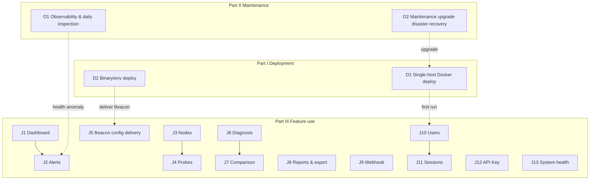
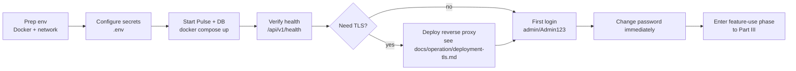
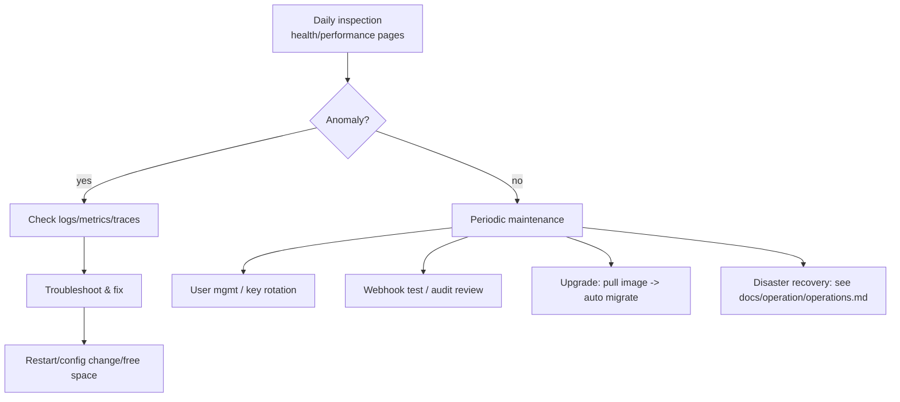
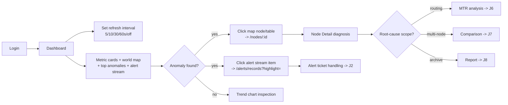
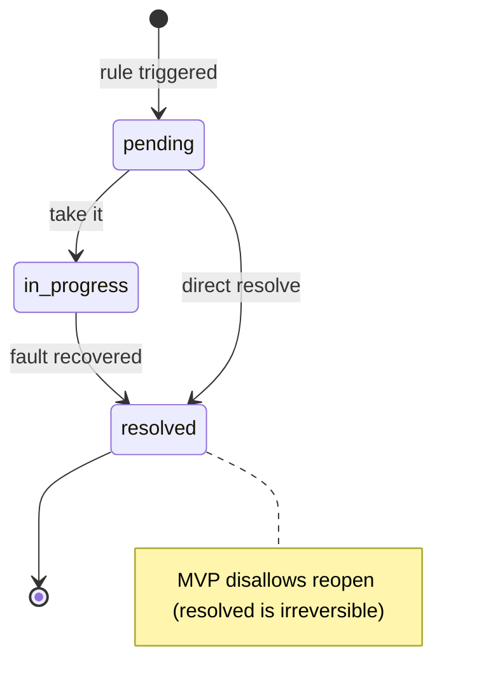

# NodePulse User Journeys & Operation Flows

> This document systematically breaks down **every NodePulse user journey and
> operation flow** from the user's perspective.
>
> Scope:
> - **Part I — Deployment (Deployer)**: zero-to-running install, first config, TLS, backups
> - **Part II — Maintenance & Operations (SRE/Admin)**: daily ops, incident response, upgrades, disaster recovery
> - **Part III — Feature use (Admin/Operator/Viewer)**: J1–J13, the 13 end-to-end functional journeys
>
> Reading guide:
> 1. Read §1 Personas → §2 Three-lifecycle overview → §3 Implementation Layer Model (this tells you the real availability of each journey)
> 2. By role: Deployer → Part I (§4–§6); SRE → Part II (§7–§9); all users → Part III (§10–§22)
> 3. §23 Implementation Gaps is the primary input for planning and backlog

---

## Table of Contents

### General
- [1. Personas & Conventions](#1-personas--conventions)
- [2. User Journey Overview (Three Lifecycles)](#2-user-journey-overview-three-lifecycles)
- [3. Implementation Layer Model](#3-implementation-layer-model)

### Part I — Deployment (Deployer)
- [4. Deployment Journey Overview](#4-deployment-journey-overview-part-i)
- [5. D1 Single-Host Docker Deployment](#5-d1-single-host-docker-deployment)
- [6. D2 Binary & Environment Deployment + Deployment Gap Catalog](#6-d2-binary--environment-deployment--deployment-gap-catalog)

### Part II — Maintenance & Operations (SRE/Admin)
- [7. Operations Journey Overview](#7-operations-journey-overview-part-ii)
- [8. O1 Observability & Daily Inspection](#8-o1-observability--daily-inspection)
- [9. O2 Maintenance Tasks & Operations Gap Catalog](#9-o2-maintenance-tasks--operations-gap-catalog)

### Part III — Feature Use (Admin/Operator/Viewer)
- [10. J1 Dashboard Inspection & Drill-Down](#10-j1-dashboard-inspection--drill-down)
- [11. J2 Alert Response & Ticket Collaboration](#11-j2-alert-response--ticket-collaboration)
- [12. J3 Node Lifecycle Management](#12-j3-node-lifecycle-management)
- [13. J4 Probe Management](#13-j4-probe-management)
- [14. J5 Beacon Deployment & Config Delivery](#14-j5-beacon-deployment--config-delivery)
- [15. J6 Network Diagnosis & MTR Analysis](#15-j6-network-diagnosis--mtr-analysis)
- [16. J7 Multi-Node Comparison](#16-j7-multi-node-comparison)
- [17. J8 Report Generation & Data Export](#17-j8-report-generation--data-export)
- [18. J9 Webhook Integration & Governance](#18-j9-webhook-integration--governance)
- [19. J10 User & Permission Management](#19-j10-user--permission-management)
- [20. J11 Sessions & Self-Service Security](#20-j11-sessions--self-service-security)
- [21. J12 API Key & Service Account Management](#21-j12-api-key--service-account-management)
- [22. J13 System Health Monitoring](#22-j13-system-health-monitoring)

### Summary
- [23. Implementation Gaps Catalog](#23-implementation-gaps-catalog)
- [24. Cross-Role Collaboration Playbooks](#24-cross-role-collaboration-playbooks)
- [25. Journey → Requirement → Status Cross-Reference](#25-journey--requirement--status-cross-reference)
- [26. Exception Flows & Edge Cases](#26-exception-flows--edge-cases)
- [27. Maintenance Conventions](#27-maintenance-conventions)

---

## 1. Personas & Conventions

### 1.1 User Personas

NodePulse targets operational monitoring of overseas infrastructure. Combining the RBAC implementation (`pulse/internal/auth/rbac.go`) with the frontend types (`frontend/src/types/auth.ts:15`), users fall into six personas — four feature-level roles plus two lifecycle roles that earlier docs missed:

| Persona | Typical profile | Core need | System boundary |
|---------|-----------------|-----------|-----------------|
| **Deployer** | Platform engineer / DevOps | Zero to running: install, first config, TLS, backups | Involved only during install; no day-to-day UI role |
| **SRE / On-call** | SRE engineer | System health, incident response, capacity, upgrades | System layer rather than the business monitoring targets |
| **Admin** | Platform owner / SRE lead | Global visibility; users/integrations/exports/system management | All actions on all resources; exclusive on users / webhooks / export / system:admin |
| **Operator** | Frontline on-call engineer | Fast fault localization, alert response, probe config | CRUD on nodes/probes/alerts; can only modify resources they created (`CheckResourceOwnership`) |
| **Viewer** | Manager / cross-team collaborator | View dashboards, alerts, join retrospectives | view only; no write operations |
| **Beacon** | Agent running on monitored nodes | Report heartbeat/metrics/MTR, pull config | Only `beacon:write` (heartbeat) + `config:read` (pull config); no human UI |

> The frontend has a **centralized RBAC route guard** via the `RequireRole` component (wraps the five admin-only pages: Users, API Keys, Audit Logs, System Config, Webhooks). Earlier per-page `role === 'admin'` checks remain for action-button visibility, but Viewers who land on an admin-only URL now get an "insufficient permissions" panel instead of a page of buttons that 403 on click.

### 1.2 Requirement Status Labels (mirrors PRD §2)

- **[Supported]** — end-to-end usable
- **[Partially Supported]** — fragments exist but the flow isn't closed-loop or not production-ready
- **[Planned]** — next-phase planning
- **[Deferred]** — explicitly off the current roadmap
- **[Not Implemented]** — code does not exist; introduced to eliminate "doc claims implemented but code is missing" misleads

### 1.3 Permission Quick Matrix (from `rbac.go:68-143`)

| Resource | Admin | Operator | Viewer | Beacon |
|----------|:-----:|:--------:|:------:|:------:|
| users | all | — | — | — |
| nodes | all | all (own) | view | — |
| probes | all | all (own) | view | — |
| alerts | all | all (own) | view | — |
| webhooks | all | — | — | — |
| export | view/create | — | — | — |
| system | all | view | view | — |
| config | view/update | — | — | read |
| beacon | read/write | read/write | — | write |

---

## 2. User Journey Overview (Three Lifecycles)

Organized by system lifecycle into **three phases**, identifying **5 deployment/ops journeys (D1–D2, O1–O2) + 13 feature journeys (J1–J13)**:



| Phase | Journey | Primary persona | Status summary |
|-------|---------|-----------------|----------------|
| **Deploy** | D1 Single-host Docker | Deployer | [Supported] |
| **Deploy** | D2 Binary/env deploy | Deployer | [Supported] |
| **Ops** | O1 Observability & daily inspection | SRE | [Supported] |
| **Ops** | O2 Maintenance / upgrade / disaster recovery | SRE/Admin | [Supported] |
| **Feature** | J1 Dashboard inspection & drill-down | Operator | [Supported] |
| **Feature** | J2 Alert response & ticket collaboration | Operator | [Supported] |
| **Feature** | J3 Node lifecycle management | Admin/Operator | [Supported] |
| **Feature** | J4 Probe management | Admin/Operator | [Supported] |
| **Feature** | J5 Beacon deployment & config delivery | DevOps | [Supported] |
| **Feature** | J6 Network diagnosis & MTR analysis | Operator | [Supported] |
| **Feature** | J7 Multi-node comparison | Operator | [Supported] |
| **Feature** | J8 Report generation & data export | Admin | [Supported] |
| **Feature** | J9 Webhook integration & governance | Admin | [Supported] |
| **Feature** | J10 User & permission management | Admin | [Supported] |
| **Feature** | J11 Sessions & self-service security | All roles | [Supported] |
| **Feature** | J12 API Key & service account management | Admin | [Supported] |
| **Feature** | J13 System health monitoring | Admin/Operator | [Supported] |

---

## 3. Implementation Layer Model

NodePulse has many capabilities where the layers don't line up — backend has a route, frontend has an API client function, but the UI has no entry point; or vice-versa, the doc claims a capability the code doesn't have. This model uses three layers to mark each capability's real status:

| Layer | Meaning | Markers |
|-------|---------|---------|
| **B** | Backend — has route/logic | ✅ yes / ❌ no / ⚠️ partial |
| **F** | Frontend API — has api client fn | ✅ yes / ❌ no |
| **U** | UI — page has a visible entry point | ✅ yes / ❌ no / ⚠️ orphan component |

Only capabilities with ✅ across all three layers are truly usable.

### 3.1 Deployment / Ops Layer Snapshot

| Capability | B | F | U | Usable | Notes |
|------------|:-:|:-:|:-:|:------:|-------|
| Single-host Docker deploy | ✅ | — | — | ✅ | `deploy/docker/docker-compose.prod.yml` |
| Auto-migration (forward) | ✅ | — | — | ✅ | golang-migrate on startup (0001–0005) |
| Admin seed (idempotent) | ✅ | — | — | ✅ | bcrypt cost 12; first-insert only |
| Secret auto-gen (dev) | ✅ | — | — | ⚠️ dev only | Prod must set explicitly or every restart rotates them |
| Pulse health endpoint | ✅ | ✅ | ✅ | ✅ | `/api/v1/health` probes DB/scheduler/alert engine/webhook |
| Pulse Prometheus metrics | ✅ | — | — | ✅ | `/metrics` (:6532) |
| Beacon Prometheus metrics | ✅ | — | — | ✅ | `/metrics` (:2112) |
| OpenTelemetry tracing | ✅ | — | — | ✅ opt-in | `telemetry.enabled` |
| Metrics data cleanup (7-day retention) | ✅ | — | — | ✅ | `metrics-cleanup` task |
| Graceful shutdown | ✅ | — | — | ✅ | SIGTERM flushes batch + drain (configurable timeout, default 10s) |
| **TLS termination / cert provisioning** | ✅ | — | — | ✅ | Via reverse proxy; `deploy/reverse-proxy/{nginx.conf,Caddyfile}` + `docs/operation/deployment-tls.md` |
| **Database backup / restore** | ✅ | — | — | ✅ | `deploy/backup/pg-backup.sh` + systemd timer; restore in `docs/operation/operations.md §3` |
| **Upgrade / rollback docs** | ✅ | — | — | ✅ | `docs/operation/upgrade.md` (forward migration + three rollback paths + compat matrix) |
| **Beacon systemd unit** | ✅ | — | — | ✅ | `beacon/deploy/beacon.service` + `install-systemd.sh` + `make install-systemd` |
| **Version / release system** | ✅ | ✅ | — | ✅ | Makefile ldflags inject `version` package; `GET /api/v1/version` |
| **Auth/session/token cleanup** | ✅ | — | — | ✅ | `auth-cleanup` task (`registry.go registerAuthCleanupTask`), wraps `auth.CleanupJob.RunAll` |
| **Pulse config hot-reload** | ✅ | — | — | ✅ Phase 1 | SIGHUP triggers `reloadConfig()`; currently covers `log.level` (DB/port/JWT still need restart) |
| **Admin unlock user** | ✅ | ✅ | ✅ | ✅ | `POST /admin/users/:id/unlock` + UsersPage "Unlock" button |
| **JWT key rotation window** | ✅ | — | — | ✅ | `JWTService.WithPreviousKey` + `PULSE_JWT_PREVIOUS_*` env, old-key grace window |

### 3.2 Feature Layer Snapshot (J1–J13)

All 13 feature journeys have closed the B+F+U loop. Key capability snapshot:

| Capability | B | F | U | Usable | Notes |
|------------|:-:|:-:|:-:|:------:|-------|
| Login/logout/session list/revoke | ✅ | ✅ | ✅ | ✅ | `/settings/sessions` |
| Alert status flow + notes | ✅ | ✅ | ✅ | ✅ | Desktop Modal + mobile |
| Node/probe/alert-rule CRUD | ✅ | ✅ | ✅ | ✅ | |
| Webhook CRUD + test + delivery log | ✅ | ✅ | ✅ | ✅ | |
| Beacon config edit/version history/rollback/template | ✅ | ✅ | ✅ | ✅ | |
| Report PDF/CSV + schedule + email | ✅ | ✅ | ✅ | ✅ | Server-side scheduling |
| Alert routing rules | ✅ | ✅ | ✅ | ✅ | RouteMatcher injection |
| API Key full lifecycle | ✅ | ✅ | ✅ | ✅ | `/settings/api-keys` |
| Audit log query | ✅ | ✅ | ✅ | ✅ | `/settings/audit-logs` |
| Password self-change + reset email | ✅ | ✅ | ✅ | ✅ | |
| WebSocket realtime (incl. node:online/offline) | ✅ | ✅ | ✅ | ✅ | Heartbeat transition + sweeper broadcast |
| TOTP 2FA | ✅ | ✅ | ✅ | ✅ | `MFAService` + `/auth/mfa/*` + PreferencesPage card |
| Notification preferences | — | ✅ | ✅ | ✅ | Client-side severity filter, localStorage-persisted |

> This table is the primary planning input: every ❌/⚠️ in the U column is a user-perceivable gap.

---

# Part I — Deployment (Deployer perspective)

## 4. Deployment Journey Overview (Part I)



## 5. D1 Single-Host Docker Deployment

> **Corresponds to PRD NFR-2.** Primary persona: Deployer. This is **the only out-of-the-box production deployment**.

### 5.1 Deployment artifacts

| Artifact | Path | Use |
|----------|------|-----|
| Production compose | `deploy/docker/docker-compose.prod.yml` | Pulse (embedded frontend) + Postgres, single-container two services |
| Pulse Dockerfile | `pulse/Dockerfile` | 3 stages: frontend build → Go compile (incl. Swagger) → Alpine runtime |
| Beacon Dockerfile | `beacon/Dockerfile` | 2 stages: static Go binary → Alpine runtime |
| Environment template | `.env.example` (root) | Postgres + Pulse secrets + CORS + telemetry |
| Config template | `pulse/pulse.yaml.example` | Full schema reference (for non-compose deploys) |

### 5.2 Required environment variables (fail-fast)

`docker-compose.prod.yml` uses `${VAR:?...}` to force-set these four or startup fails:

| Variable | Use |
|----------|-----|
| `POSTGRES_PASSWORD` | Database password |
| `PULSE_ADMIN_PASSWORD` | Initial admin password (8–32 chars, upper+lower+digit) |
| `PULSE_SESSION_SECRET` | Session encryption key (`openssl rand -hex 32`) |
| `PULSE_JWT_SECRET` | JWT signing key (`openssl rand -hex 32`) |

> ⚠️ If a binary (non-Docker) deploy omits the last two secrets, **every restart regenerates them, invalidating all sessions/JWTs**. The compose requirement exists precisely to prevent this.

### 5.3 Startup flow (automatic)

1. `docker compose up -d --build` builds and starts
2. Postgres ready (`pg_isready` health check)
3. Pulse starts → `config.MustLoad()` (Viper) → connect DB → **auto-migrate** (`0001`–`0005`) → **seed admin** (idempotent, first insert only) → start scheduler + node-status sweeper → listen on :6532
4. Pulse container health check: `wget /api/v1/health` (10s interval)

### 5.4 Verify

```bash
curl http://localhost:6532/api/v1/health   # expect {"status":"healthy",...}
# Browser → http://localhost:6532 → login page
# Default credentials: admin / the PULSE_ADMIN_PASSWORD you set in .env
```

### 5.5 Status

- Single-host Docker deploy **[Supported]**.
- Auto-migration, admin seed, secret gen (dev), health check **[Supported]**.
- **TLS, backup, upgrade path**: see §6.

---

## 6. D2 Binary & Environment Deployment + Deployment Gap Catalog

> Non-Docker deploy, Beacon distribution, and all deployment-phase gaps.

### 6.1 Binary deploy (outside Docker)

```bash
# Pulse
cd pulse && make build        # produces bin/pulse-api
./bin/pulse-api               # reads ./pulse.yaml or /etc/node-pulse/pulse.yaml

# Beacon (distribute to monitored nodes)
cd beacon && make build       # produces build/beacon (static Linux AMD64)
make install                  # cp to /usr/local/bin/beacon
beacon start                  # reads ./beacon.yaml or BEACON_CONFIG_PATH
```

### 6.2 Deployment gap catalog (D series)

| # | Gap | Status | Impact | Resolution |
|---|-----|--------|--------|------------|
| **D-G1** | **No TLS termination / cert provisioning** | ✅ Resolved | Pulse previously listened in plaintext; reverse-proxy reference now shipped | `docs/operation/deployment-tls.md` + `deploy/reverse-proxy/{nginx.conf,Caddyfile}` |
| **D-G2** | **No database backup/restore** | ✅ Resolved | Single volume was a single point of data loss | `deploy/backup/pg-backup.sh` + systemd timer + `docs/operation/operations.md §3` |
| **D-G3** | **No upgrade/rollback docs** | ✅ Resolved | Upgrades were blind operations | `docs/operation/upgrade.md` (three rollback paths + compat matrix) |
| **D-G4** | **Beacon has no service management (systemd)** | ✅ Resolved | `make install` only copied the binary | `beacon/deploy/{beacon.service,install-systemd.sh}` + `make install-systemd` |
| **D-G5** | **No version/release system** | ✅ Resolved | `service_version="unknown"`, no git tags | `pulse/internal/version` + `beacon/internal/version` + Makefile ldflags + `GET /api/v1/version` |
| **D-G6** | `.env.example` "Frontend (nginx)" dead reference | ✅ Resolved | `FRONTEND_PORT=80` had no consumer (frontend embeds into Pulse) | Removed |
| **D-G7** | No "first-run wizard" / empty-state guidance | 🟡 UX | New admin sees a 0-node empty dashboard with no guidance | Empty-state CTA + Getting Started checklist |
| **D-G8** | README Quick Start disjoint from API Key creation | 🟡 UX | Step says "generate api_key from UI" but not which page (`/settings/api-keys`) | Cross-reference |

### 6.3 Status

- Binary build & distribution **[Supported]** (systemd unit + version system in place).
- Other deployment capabilities: D-G1–G6 all resolved; D-G7/G8 are UX polish.

---

# Part II — Maintenance & Operations (SRE/Admin perspective)

## 7. Operations Journey Overview (Part II)



## 8. O1 Observability & Daily Inspection

> **Corresponds to PRD NFR-4.** Primary persona: SRE. This is NodePulse's **most complete** operations dimension.

### 8.1 Three pillars of observability

| Pillar | Pulse | Beacon | Notes |
|--------|-------|--------|-------|
| **Logs** | slog → stdout (no rotation) | slog + lumberjack file rotation | Pulse relies on container runtime for log rotation; Beacon self-manages |
| **Metrics** | `/metrics` (:6532) | `/metrics` (:2112) | Full Prometheus catalog in `docs/observability.md` |
| **Traces** | OpenTelemetry (opt-in) | otelhttp injects traceparent | Beacon↔Pulse end-to-end correlation |

### 8.2 Health endpoint (`GET /api/v1/health`, public)

`pulse/internal/health/health.go` probes:
- **Database** — `pool.Ping`; nil DB shows `disabled`; failure → `unhealthy` (503)
- **Scheduler** — `metrics-cleanup` task status (stale/error degrades health)
- **Alert engine** — 5-min cache staleness → `stale`; channel full → `full`
- **Webhook delivery** — recent success rate
- **Alert suppression** — active suppression count

Three states: `healthy` (200) / `degraded` (200) / `unhealthy` (503).

### 8.3 Frontend operations dashboards

| Page | Route | Use | Poll |
|------|-------|-----|------|
| System health | `/integrations/health` | Overall status + per-subsystem cards | 15s |
| Performance dashboard | `/performance` | P95/P99 trends + anomaly list + P0/P1 toast | 60s |
| System config | `/settings/system-config` | Read-only config + revalidate (admin) | manual |

### 8.4 Daily inspection operations

| Step | Operation | Entry | Role |
|------|-----------|-------|------|
| 1 | View overall health | `/integrations/health` | Admin/Operator/Viewer |
| 2 | Check webhook success rate / suppression count | Health page cards | Admin/Operator |
| 3 | View performance trends / anomalies | `/performance` | Admin/Operator/Viewer |
| 4 | View realtime node status | `/dashboard` (WS node:online/offline) | All |
| 5 | Audit log review | `/settings/audit-logs` | Admin |
| 6 | Prometheus scrape | External Prometheus scrapes `/metrics` | SRE |

### 8.5 Status

- Metrics, health, traces, frontend dashboards **[Supported]**.
- Pulse log has no native rotation **[Partially Supported]** (depends on container runtime).
- **`prometheus.yml` / alert rules are now shipped** at `deploy/observability/` (see `docs/observability.md` for the metric catalog).

---

## 9. O2 Maintenance Tasks & Operations Gap Catalog

> Daily maintenance operations + all operations-phase gaps.

### 9.1 Daily maintenance tasks (Admin)

| Task | Entry | Frequency | Status |
|------|-------|-----------|--------|
| User lockout investigation | `/settings/users` | As needed | ✅ ("Unlock" button) |
| API Key rotation | `/settings/api-keys` | 90 days recommended | ✅ (old key 24h transition) |
| Webhook URL change + test | `/integrations/webhooks` | As needed | ✅ |
| Audit log review | `/settings/audit-logs` | Periodic | ✅ |
| Force logout | `/settings/users` | Emergency | ✅ |
| Config change (log level) | Edit `pulse.yaml` → `kill -HUP <pid>` | As needed | ✅ Phase 1 (log.level only; DB/port/JWT still need restart) |
| JWT key rotation | Set `PULSE_JWT_PREVIOUS_*` env → restart → wait out expiry → clear → restart | Periodic | ✅ (old-key grace window) |
| Session key rotation | Change env → **restart** | Periodic | ❌ No concurrent old+new window (restart invalidates all sessions) |

### 9.2 Data retention & cleanup

| Task | Implementation | Status |
|------|----------------|--------|
| Metrics data cleanup (7-day retention) | `metrics-cleanup` scheduled task | ✅ running |
| Alert suppression cleanup | `suppression-cleanup` scheduled task | ✅ running |
| Export file cleanup | `cleanupOldExports` | ✅ running |
| **Audit/session/token/API key cleanup** | `auth-cleanup` task (wraps `auth.CleanupJob.RunAll`) | ✅ running |

> The `auth-cleanup` task is wired through `server/auth_cleanup_task.go` (adapts `auth.CleanupJob` to `scheduler.Task`) and registered in `registry.go registerAuthCleanupTask`. It runs every `cleanup.IntervalSeconds` (default 86400s) and covers refresh_tokens / token_blacklist / rate_limits (24h) / auth_audit_logs (90 days) / expired_api_keys (30 days). The `authentication.md` "Audit Log Retention" section reflects the real implementation.

### 9.3 Upgrade

| Step | Operation | Status |
|------|-----------|--------|
| 1 | Pull new code/image | `docker compose up -d --build` |
| 2 | Forward migration runs automatically | ✅ golang-migrate on startup |
| 3 | Verify health | `curl /api/v1/health` |
| Rollback | Documented in `docs/operation/upgrade.md` | ✅ three rollback paths |

### 9.4 Incident response (known scenarios)

| Incident | System behavior | Recovery |
|----------|-----------------|----------|
| DB unreachable | Pulse starts in DEGRADED MODE (nil DB), `/health` shows `database:disabled` | Restore DB → restart |
| Beacon can't reach Pulse | Heartbeat retry (reconnect config) + PriorityCache local persistence | Resume after network recovery |
| Node timeout (5min) | NodeStatusSweeper marks offline + broadcasts node:offline | Node resumes heartbeat → broadcasts node:online |
| Disk full | No explicit handling; auth tables are now pruned by `auth-cleanup` | — |
| Graceful shutdown | SIGTERM → stop cache/BatchWriter (flush) → stop NodeStatusSweeper → stop scheduler → HTTP drain (`server.go:70-97`, configurable timeout default 10s) | — |

### 9.5 Operations gap catalog (O series)

| # | Gap | Status | Impact | Resolution |
|---|-----|--------|--------|------------|
| **O-G1** | **Auth/session/token cleanup not wired** | ✅ Resolved | Auth tables no longer grow unbounded | `auth-cleanup` task registered to scheduler |
| **O-G2** | **No admin "unlock user"** | ✅ Resolved | Locked users had to wait 10 min or hit the DB | `POST /admin/users/:id/unlock` + UI "Unlock" button |
| **O-G3** | **No JWT rotation window** | ✅ Resolved | Rotation previously invalidated every token at once | `JWTService.WithPreviousKey` + `PULSE_JWT_PREVIOUS_*` env |
| **O-G4** | **Pulse has no hot-reload** | ✅ Resolved (Phase 1) | Config changes forced full restart | SIGHUP triggers `reloadConfig()`; covers `log.level` (DB/port/JWT still restart-only) |
| **O-G5** | Graceful shutdown timeout not configurable | ✅ Resolved | Large batch flushes / long exports could be truncated | `server.shutdown_timeout_seconds` (default 10) |
| **O-G6** | No TrustedProxies config | ✅ Resolved | Behind a reverse proxy, `ClientIP()` / audit IP were wrong | `server.trusted_proxies` CIDR list; builder calls `SetTrustedProxies` |
| **O-G7** | No ops runbook / troubleshooting docs | ✅ Resolved | Ops knowledge was scattered across 8+ docs | `docs/operation/operations.md` consolidates health triage, incident playbooks, backup/restore, config changes |
| **O-G8** | No Prometheus/dashboard config shipped | ✅ Resolved | `docs/observability.md` had examples but `deploy/` had nothing applicable | `deploy/observability/{prometheus.yml,pulse-alerts.yml}` |

### 9.6 Status

- Observability, health endpoint, graceful shutdown, metrics cleanup **[Supported]**.
- **Backup, upgrade docs, ops runbook, TLS, unlock user, JWT rotation, hot-reload, shutdown timeout, trusted proxies**: ✅ resolved.
- All §23 P0–P4 gaps closed.

---

# Part III — Feature Use (Admin/Operator/Viewer perspective)

## 10. J1 Dashboard Inspection & Drill-Down

> **Corresponds to PRD §4.1.** Primary persona: Operator; Admin and Viewer read-only.

### 10.1 Journey map



### 10.2 Operation steps

| Step | Operation | Entry / route | Role |
|------|-----------|---------------|------|
| 1 | Login | `/login` → `/dashboard` | All |
| 2 | Set auto-refresh interval (5/10/30/60s/off) | Dashboard top dropdown | All |
| 3 | Manual refresh | Dashboard refresh button (concurrent nodes+metrics pull, 5s poll, 4 failures back off 60s) | All |
| 4 | Browse metric cards + world map + top anomalies | Dashboard | All |
| 5 | Browse alert stream (WebSocket realtime) | Dashboard `AlertStream`, polling fallback on disconnect | All |
| 6 | Map node click drill-down | `WorldMap.onNodeClick` → `/nodes/:id` | All |
| 7 | Alert item click | `AlertStream` → `/alerts/records?highlight=<id>` | All |

### 10.3 System behavior

- The dashboard uses an **in-memory ring-buffer cache** (60 points per node), typically < 300ms.
- The alert stream uses **WebSocket**, and the frontend consumes three events: `alert:new`/`alert:updated`/`alert:resolved` (`useGlobalRealtime.ts:48-89`). The backend additionally broadcasts `alert:note_created` (`hub.go:149-158`), but the frontend **does not consume** it (notes refresh via the note API response or by re-fetching records, not via WS). 30s ping, exponential-backoff reconnect on disconnect (1s×2, capped at 30s).
- **Global notification layer**: `AppLayout` holds a single `useGlobalRealtime` instance; browser notifications fire on all protected pages.
- **Node online/offline realtime events**: heartbeat-arrival transition → broadcasts `node:online`; sweeper timeout → broadcasts `node:offline`; the frontend updates `nodesStore` in real time.

### 10.4 Status

- Dashboard four-pack, drill-down, WebSocket alert stream, polling fallback, global notifications, realtime node status **[Supported]**.

---

## 11. J2 Alert Response & Ticket Collaboration

> **Corresponds to PRD §4.2.** Primary persona: Operator; Viewer read-only. The journey with the **most complex data model**.

### 11.1 Alert state machine (`alert_record.go:64-80`)



### 11.2 Operation steps

| Step | Operation | Entry | Permission | Status |
|------|-----------|-------|------------|--------|
| 1 | Spot alert (alert stream or `/alerts/records`) | Dashboard / `/alerts/records` | view | ✅ |
| 2 | Multi-dim filter (search/node/time/level/status) | `AlertRecordsFilter` | view | ✅ |
| 3 | Sort, paginate | Header click | view | ✅ |
| 4 | Export current alerts as CSV | `/alerts/records` top button | view | ✅ |
| 5 | Open alert detail Modal | "View details" | view | ✅ |
| 6 | View unified timeline (create/status change/note) | `AlertRecordDetailModal` timeline | view | ✅ |
| 7 | Update status (take/resolve) | In-modal button; backend `models.CanTransitionTo` (`alert_record.go:64-80`) validates, frontend mirror pure fn `isValidStatusTransition` (`api/alertRecords.ts:106`) | admin/operator | ✅ |
| 8 | **Add investigation note** | `AlertRecordDetailModal` input + Ctrl/Cmd+Enter | admin/operator | ✅ |
| 9 | Jump to node from detail | "View node" → `/nodes/:id` | view | ✅ |
| 10 | Inline status transition on `/alerts/history` | `/alerts/history` | admin | ✅ |
| 11 | Mobile alert detail (incl. note input) | `AlertDetailMobile` (isMobile gated) | admin/operator | ✅ |

### 11.3 Status

- Alert creation, status transition, timeline view, note creation, WebSocket push, mobile **[Supported]**.

---

## 12. J3 Node Lifecycle Management

> Primary persona: Admin (full), Operator (own).

### 12.1 Operation steps

| Step | Operation | Entry | Permission |
|------|-----------|-------|------------|
| 1 | View node list | `/nodes` | view (all roles) |
| 2 | Click node name → detail | `/nodes/:id` | view |
| 3 | Create node | `NodeDialog` | admin/operator (frontend `canEdit = role==='admin' \|\| role==='operator'`) |
| 4 | Edit/delete node | Dialog / AlertDialog | admin/operator |

> Frontend and backend RBAC are aligned: `NodeManagementPage.tsx:34-36` sets `canEdit = admin || operator` (comment records the history: it previously hid this from operators by mistake), and `routes.go:379,382,385,388` guards POST/PUT/DELETE via `RBACMiddleware(["admin","operator"])`. Operators see the create/edit/delete buttons.

### 12.2 Status

[Supported].

---

## 13. J4 Probe Management

> Primary persona: Admin/Operator.

### 13.1 Operation steps

Filter by node → create/edit/delete probes (TCP/UDP; MTR goes through Beacon config). The frontend `ProbeManagementPage.tsx:48-50` has an explicit UI gate `canEdit = admin || operator` (comment: "gate the UI so viewers don't trigger 403s on click"), so Viewers can't click write buttons; the backend `routes.go:407` guards via `RBACMiddleware(["admin","operator"])`.

### 13.2 Status

[Supported].

---

## 14. J5 Beacon Deployment & Config Delivery

> Primary persona: DevOps engineer + Beacon service account. Two modes: standalone and registered.

### 14.1 Beacon CLI (`beacon/internal/cli/`)

| Command | Action |
|---------|--------|
| `beacon start` | Start agent (load → validate → probe schedule → hot-reload → resource monitor → Prometheus → registered auth+heartbeat+config sync+MTR) |
| `beacon stop` | Graceful stop (read PID → SIGTERM → wait 30s) |
| `beacon status` | JSON state (node_id/PID/running) |
| `beacon debug` | Diagnostic snapshot (network/config/resource/probe/Prometheus); `--pretty` for human-readable |

Signals: SIGINT/SIGTERM → graceful shutdown; **SIGHUP → config hot-reload**.

### 14.2 Frontend config delivery (`/beacons/config`)

| Step | Status |
|------|--------|
| Select node, edit config, save version | ✅ |
| View Ack status badge | ✅ |
| Version history + **rollback button** | ✅ |
| Config preview | ✅ |
| Group batch delivery | ✅ |
| Config templates (server-side CRUD) | ✅ (ADR-003) |

### 14.3 Beacon runtime features

- **Degraded-mode state machine**: `ModeManager` wired into `start.go`; heartbeat failure drives degraded metrics
- **Compressed transport**: `SendCompressedHeartbeat`, `{data: base64(gzip), checksum: crc32}` → `/heartbeat/compressed`
- **Failed-heartbeat persistence/resume**: `PriorityCache` buffer + startup `load()` recovery + shutdown `Persist()` flush
- **reconnect config**: `WithReconnectConfig` wired into `reportWithRetry`, zero-value falls back to defaults

### 14.4 Status

[Supported].

---

## 15. J6 Network Diagnosis & MTR Analysis

> Primary persona: Operator.

### 15.1 Operation steps

Node detail → realtime metric card (5s poll) → trend chart (24h/7d/30d) → problem diagnosis (owner attribution) → MTR path → history snapshot → diagnostic report. **Interactive path-risk detail** (`MTRPathVisualization`) is wired in.

### 15.2 Status

[Supported].

---

## 16. J7 Multi-Node Comparison

> Primary persona: Operator. Corresponds to PRD §4.4.

Multi-select nodes (2–5) → grouping → time range → metric → `ComparisonChart` → server-side diagnosis (auto-fetched when ≥3 nodes).

### 16.1 Status

[Supported].

---

## 17. J8 Report Generation & Data Export

> Primary persona: Admin (export is admin-only).

### 17.1 Operation steps

| Step | Status |
|------|--------|
| Pick report type + multi-select nodes + date + format CSV/PDF | ✅ |
| PDF preview Dialog → print | ✅ |
| CSV export task (persisted) → poll → download | ✅ |
| Export history (filter/paginate/download/delete) | ✅ |
| **Report schedule** (daily/weekly/monthly) → server-side scheduling + PDF/CSV + SMTP email | ✅ (ADR-001) |
| XLSX export | ❌ disabled (planned) |

### 17.2 Status

[Supported]; XLSX still planned.

---

## 18. J9 Webhook Integration & Governance

> Primary persona: Admin (sole manager). Corresponds to PRD §4.5.

### 18.1 Operation steps

| Step | Status |
|------|--------|
| CRUD (URL must be https + SSRF check) | ✅ |
| Preview payload + test delivery + enable toggle | ✅ |
| **Delivery log query** (`GET /webhooks/:id/logs` + Dialog) | ✅ |
| **Alert routing rules** (`alert_routing_rules` + RouteMatcher injection) | ✅ (ADR-002) |
| **Severity filter** (`rule.Severities` matches `event.Level`, ADR-002 Tier 1) | ✅ (`router.go:66-86`) |
| Custom headers (`Webhook` struct has no Headers field) | ❌ planned |

### 18.2 Status

[Supported].

---

## 19. J10 User & Permission Management

> Primary persona: Admin (exclusive).

User list (status/role/lock badge) → CRUD → inline role change (self disabled) → delete (self disabled). No explicit "activate/deactivate" toggle; locking is driven by the 5-failures→10-min mechanism. A dual role system coexists (string enum vs RBAC tables, the latter not wired through).

### 19.1 Status

[Supported]; custom roles / fine-grained permissions not expanded.

---

## 20. J11 Sessions & Self-Service Security

> Primary persona: All roles (manage themselves).

### 20.1 Operation steps

| Step | Status |
|------|--------|
| Login (5/min rate limit; 5 failures lock 10 min) | ✅ |
| Session list + single-session revoke + cross-tab sync | ✅ |
| **Revoke all own sessions** | ✅ |
| **Change own password** | ✅ (PreferencesPage Security card) |
| **Password reset email** (SMTP) | ✅ (`/forgot-password`+`/reset-password` pages + backend API) |
| **Admin force-logout** | ✅ |
| **TOTP 2FA enable/disable** | ✅ (PreferencesPage 2FA card) |
| Theme/language/timezone preferences | ✅ |
| **Notification preferences** (severity filter, master switch) | ✅ |

### 20.2 Status

[Supported].

---

## 21. J12 API Key & Service Account Management

> Primary persona: Admin.

API Key full lifecycle (list/get/create/rotate/revoke) with complete UI. On rotation the old key gets a 24h transition (zero downtime). The `api_keys` table has an XOR constraint tying it to either a user or a service account. **Audit log query** is a separate global page at `/settings/audit-logs` (`AuditLogsPage`, filter by time/user/event), not embedded inside an individual key's detail.

### 21.1 Status

[Supported].

---

## 22. J13 System Health Monitoring

> Primary persona: Admin/Operator.

### 22.1 Operation steps

| Step | Entry |
|------|-------|
| Overall health (DB/scheduler/alert subsystem, healthy/degraded/unhealthy) | `/integrations/health`, 15s poll |
| Alert-system detail (engine state/cached rules/channel depth/webhook success rate/suppression count) | cards |
| Performance dashboard (P95/P99 trends/anomalies/P0·P1 toast) | `/performance`, 60s poll |
| System config read-only + revalidate | `/settings/system-config` (admin) |

### 22.2 Status

[Supported].

---


## 23. Implementation Gaps Catalog

All gaps merged across the three lifecycles, graded by severity. Disposition markers:
- **Resolved** — end-to-end closed
- **Not Implemented** — code does not exist
- **Doc-Claimed-But-Missing** — doc claimed implemented but code is missing (highest-priority correction)
- **Open** — not yet addressed

### 23.1 P0 — Data security / compliance / real bugs (must fix)

| # | Gap | Category | Status | Impact | Resolution |
|---|-----|----------|--------|--------|------------|
| **O-G1** | Auth/session/token cleanup not wired | Ops | ✅ Resolved | Auth tables no longer grow unbounded | `auth-cleanup` task registered to scheduler (`registry.go registerAuthCleanupTask`) |
| **D-G2** | No database backup/restore | Deploy | ✅ Resolved | Single-volume single point of failure removed | `deploy/backup/pg-backup.sh` + systemd timer + `docs/operation/operations.md §3` |
| **F1** | `Reports.tsx` schedule button had no role guard | Feature | ✅ Resolved | Non-admins clicking got 403 | `isAdmin` guards create/enable/delete via `useAuthStore().role` |

### 23.2 P1 — Production readiness (should prioritize)

| # | Gap | Category | Status | Impact |
|---|-----|----------|--------|--------|
| **D-G1** | No TLS termination/cert | Deploy | ✅ Resolved | nginx/Caddy reverse-proxy reference shipped |
| **D-G3** | No upgrade/rollback docs | Deploy | ✅ Resolved | `docs/operation/upgrade.md` (three rollback paths + compat matrix) |
| **O-G7** | No ops runbook | Ops | ✅ Resolved | `docs/operation/operations.md` consolidates ops knowledge |
| **O-G2** | No admin unlock-user | Ops | ✅ Resolved | `POST /admin/users/:id/unlock` + UI button |
| **F2** | No centralized RBAC route guard | Feature | ✅ Resolved | `RequireRole` component guards 5 admin-only pages |

### 23.3 P2 — Completeness / UX

| # | Gap | Category | Status |
|---|-----|----------|--------|
| **D-G4** | Beacon no systemd unit | Deploy | ✅ Resolved — `beacon/deploy/beacon.service` + `install-systemd.sh` + `make install-systemd` |
| **D-G5** | No version/release system | Deploy | ✅ Resolved — `pulse/internal/version` + `beacon/internal/version` + Makefile ldflags + `GET /api/v1/version` |
| **O-G3** | No JWT rotation window | Ops | ✅ Resolved — `JWTService.WithPreviousKey` + `JWTConfig.Previous*` + `PULSE_JWT_PREVIOUS_*` env |
| **O-G4** | Pulse no hot-reload | Ops | ✅ Resolved (Phase 1) — SIGHUP triggers `reloadConfig()`; covers `log.level` (other config still needs restart) |
| **F3** | Viewer no read-only webhook/export view | Feature | ✅ Resolved — Webhooks guarded by `RequireRole`; Reports `ReportGenerator` shows admin-only notice to non-admins |
| **F4** | No notification preferences / multi-channel | Feature | ✅ Resolved (Phase 1) — user-level browser-notification prefs (master switch + min-severity filter + node online/offline toggle), localStorage-persisted; per-user server-side email/multi-channel routing is a future extension |
| **F5** | No 2FA/MFA | Feature | ✅ Resolved — TOTP 2FA end-to-end (`MFAService` + `/auth/login/mfa` + `/auth/mfa/{setup,verify,disable,status}` + login second-step UI + PreferencesPage card) |
| **O-G8** | No Prometheus/dashboard config shipped | Ops | ✅ Resolved — `deploy/observability/{prometheus.yml,pulse-alerts.yml}` |

### 23.4 P3 — Doc errata

| # | Gap | Status |
|---|-----|--------|
| **F7** | `architecture.md`/`ui-design.md` route tables stale (3 `/settings/*` listed, actually 6) | ✅ Resolved |
| **F8** | `prd.md` referenced non-existent `docs/iteration-roadmap.md` | ✅ Resolved (points to user-journey §23) |
| **D-G6** | Root `.env.example` "Frontend (nginx)" dead reference | ✅ Resolved |

### 23.5 Resolved earlier (historical)

G1 alert notes, G2 API Keys page, G3 export persistence, G4 webhook delivery log, G5 password change, G6 audit-log page, G7 force-logout, G8 config preview, G9 batch delivery, G10 bulk revoke, G11 system-config page, G16–G19 Beacon runtime wiring, G20/G21 orphan-component wiring, G22–G24 dead-code cleanup — all **Resolved**.

---

## 24. Cross-Role Collaboration Playbooks

### 24.1 Playbook A — Cross-border latency spike (incident response)

| Time | Role | Action | Journey |
|------|------|--------|---------|
| T0 | Beacon | Heartbeat reports high latency | J5 |
| T1 | Pulse | Alert engine evaluates trigger rule | J2 |
| T2 | Pulse | Creates alert_record + suppression | J2 |
| T3 | Pulse | Webhook push + WS alert:new | J9/J1 |
| T4 | Operator | Dashboard alert stream / browser notification received | J1 |
| T5 | Operator | Take it → in_progress | J2 |
| T6 | Operator | Drill into Node Detail, view MTR and diagnosis | J6 |
| T7 | Operator | Multi-node comparison judges cross-border | J7 |
| T8 | Operator | Add investigation note | J2 |
| T9 | Operator | Generate report PDF for archival | J8 |
| T10 | Operator | Resolve → resolved | J2 |

### 24.2 Playbook B — New node onboarding (deploy flow)

| Time | Role | Action | Journey |
|------|------|--------|---------|
| T0 | Deployer | Deploy Pulse + DB (D1) | Deploy |
| T1 | Admin | First login, change password | J11 |
| T2 | Admin | Create API Key | J12 |
| T3 | Admin | Create node + configure probes | J3/J4 |
| T4 | DevOps | Write beacon.yaml (incl. api_key) → beacon start | J5 |
| T5 | Beacon | API Key → JWT + heartbeat + pull config + Ack | J5 |
| T6 | Operator | Dashboard sees new node online (WS node:online) | J1 |

### 24.3 Playbook C — Disaster recovery

| Time | Role | Action | Status |
|------|------|--------|--------|
| T0 | SRE | Detect data corruption/loss | — |
| T1 | SRE | Restore from backup | ✅ `deploy/backup/pg-backup.sh` + `docs/operation/operations.md §3` |
| T2 | SRE | Verify health post-restore | ✅ `curl /api/v1/health` |

---

## 25. Journey → Requirement → Status Cross-Reference

| Journey | Key capabilities | PRD FR/NFR | Overall status | Notes |
|---------|------------------|-----------|----------------|-------|
| D1 Docker deploy | Single-host stack, auto-migration, secret gen, TLS, backup | NFR-2 | **[Supported]** | — |
| D2 Binary deploy | Build, distribution, systemd, versioning | NFR-2 | **[Supported]** | — |
| O1 Observability | Logs/metrics/health/tracing | NFR-4 | **[Supported]** | Pulse log has no native rotation |
| O2 Maintenance | Cleanup/upgrade/backup/unlock/rotation/hot-reload | NFR-2/6 | **[Supported]** | — |
| J1 Dashboard | Dashboard four-pack, drill-down, WS, global notifications, realtime nodes | FR-3 | **[Supported]** | — |
| J2 Alerts | Create/status/timeline/notes/routing | FR-4 | **[Supported]** | — |
| J3 Nodes | CRUD, detail | FR-3 | **[Supported]** | — |
| J4 Probes | CRUD | FR-3 | **[Supported]** | — |
| J5 Beacon | Dual-mode/heartbeat/Ack/version/rollback/template/compression/resume/degraded | FR-1 | **[Supported]** | — |
| J6 Diagnosis | Metrics/MTR/diagnosis/path-risk | FR-2 | **[Supported]** | — |
| J7 Comparison | Multi-node comparison | FR-3 | **[Supported]** | — |
| J8 Reports | PDF/CSV/history/schedule/email | FR-5 | **[Supported]** | XLSX planned |
| J9 Webhook | CRUD/preview/test/delivery-log/routing | FR-4 | **[Supported]** | — |
| J10 Users | CRUD/role/force-logout | FR-6 | **[Supported]** | Custom roles not expanded |
| J11 Sessions | Login/list/revoke/password-change/bulk/reset-email/2FA/notifications | FR-6 | **[Supported]** | — |
| J12 API Key | Full lifecycle + audit | FR-6 | **[Supported]** | — |
| J13 Health | Overall health/performance dashboard | NFR-4 | **[Supported]** | — |

---

## 26. Exception Flows & Edge Cases

### 26.1 Auth & session exceptions

- **Login failure**: 5/min/IP rate limit; account locks for 10 min after 5 failures.
- **Access-token expiry**: Axios 401 interceptor silently refreshes; failure → redirect to login.
- **Cross-tab logout**: localStorage broadcast sync.
- **StrictMode double-trigger**: `useRef` guards session restore.

### 26.2 Data reporting exceptions (Beacon)

- **Pulse unreachable**: heartbeat retry driven by `reconnect` config (default 3 attempts, exponential backoff); **failed payloads persist locally** (PriorityCache) + resume on reconnect.
- **JWT 401**: automatically invalidate token and re-exchange.
- **Node timeout**: `NodeStatusSweeper` marks offline after 5 min + broadcasts.

### 26.3 Alert & push exceptions

- **Alert storm**: suppression + worker pool rate-limits.
- **Webhook failure**: write log + retry; delivery log queryable.
- **WebSocket disconnect**: exponential-backoff reconnect + polling fallback.

### 26.4 Deployment / ops exceptions

- **DB unreachable**: Pulse starts in DEGRADED MODE (nil DB), `/health` shows `database:disabled`.
- **Disk full**: no explicit handling; auth tables are now pruned by `auth-cleanup`.
- **Graceful shutdown**: SIGTERM → flush batch → stop scheduler → HTTP drain (configurable timeout `server.shutdown_timeout_seconds`, default 10s).

### 26.5 Frontend paradigms

Two data-fetching paradigms coexist: TanStack Query hooks (idle ones removed) vs store + hand-rolled polling (the one actually in effect). Unifying them is tracked as future tech debt.

---

## 27. Maintenance Conventions

- This document evolves alongside the PRD.
- When adding/changing a journey, update: §2 three-phase overview → the journey's section → §25 cross-reference table → any affected §23/§26.
- Every capability must carry **B/F/U three-layer status** to avoid the "backend has it = user can use it" misjudgment.
- **Gaps must be honestly marked** (`[Not Implemented]` / `[Doc-Claimed-But-Missing]` / `[Planned]`); "doc claims implemented but code is missing" is forbidden.
- Flow charts use Mermaid; status labels come from §1.2 and stay consistent with PRD §2.
- Permission annotations stay consistent with `pulse/internal/auth/rbac.go`.
- Change history lives in git; do not maintain a separate changelog table in this file.
