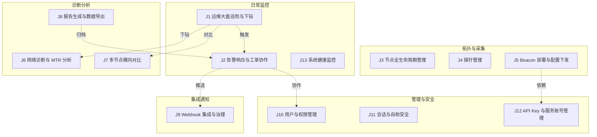
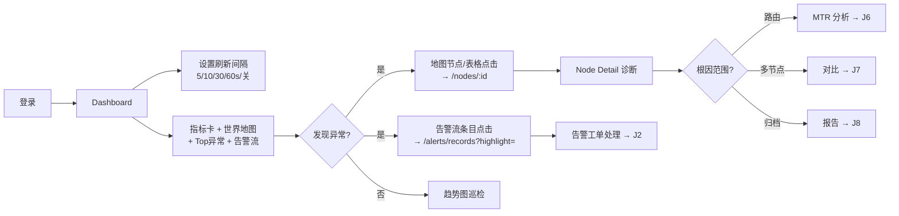
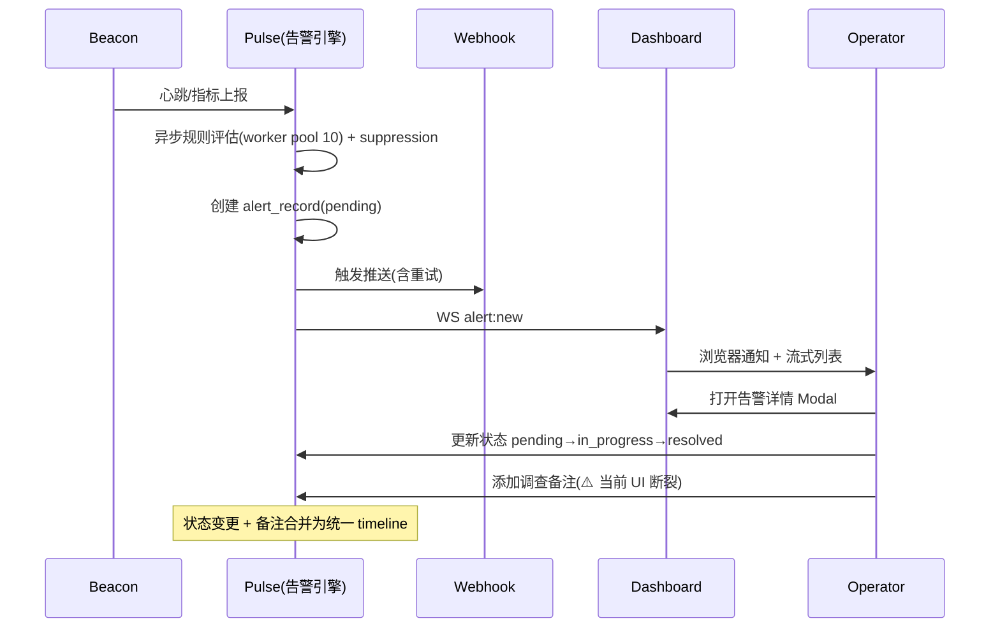
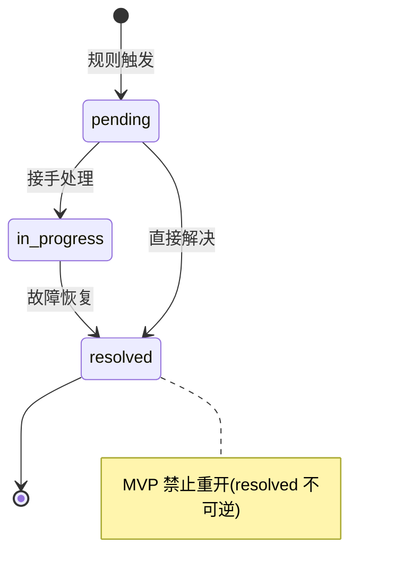
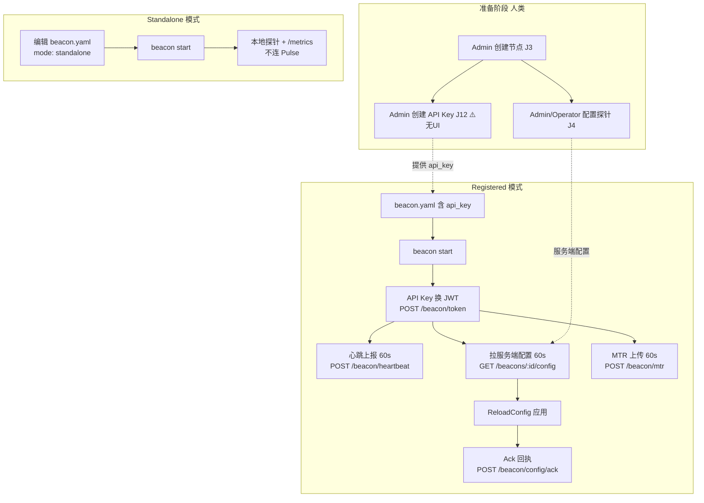
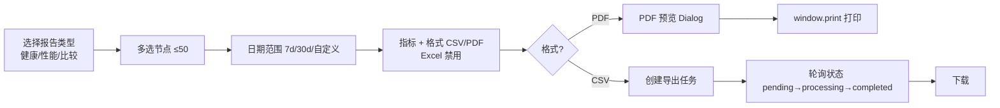
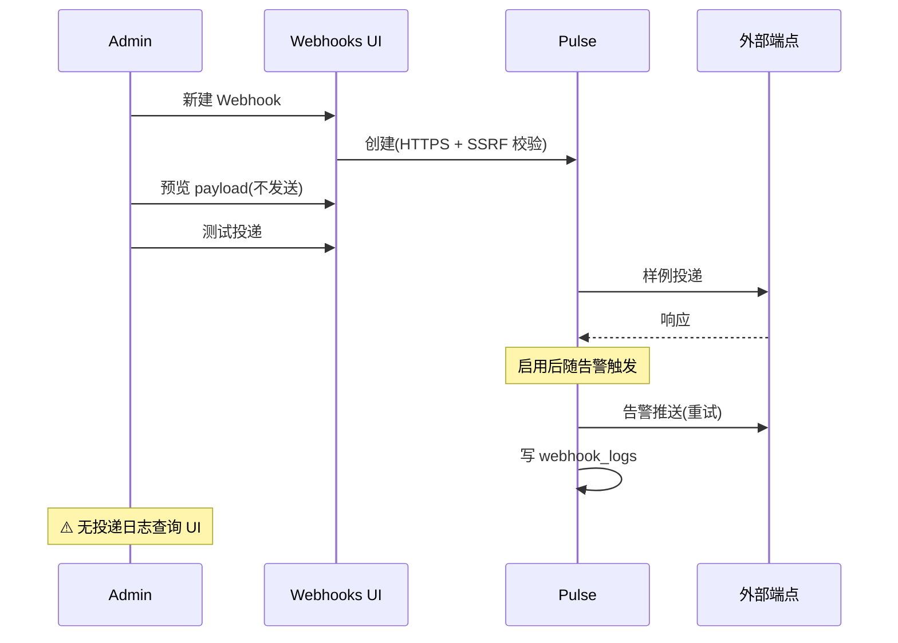
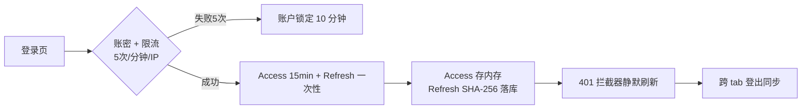

# NodePulse 用户旅程与操作流程

**Owner:** Kevin
**Date:** 2026-07-04
**Version:** 2.3
**Status:** 基于五维交叉验证（需求 PRD / 后端 API / 前端 UI / 数据模型 / Beacon 实现）的完整用户旅程分析；v2.3 三处假服务端能力落地为真实后端 + 全局通知 + 密码重置邮件

> 本文档从 **使用者视角** 系统拆解 NodePulse 的全部用户旅途与操作流程。
> 上一版（v1.0）仅覆盖了 PRD §4 写明的 5 条主旅程，遗漏了大量由代码实现
> 但未被 PRD 显式描述的能力。本版基于以下五个维度的交叉验证重建：
>
> 1. **需求维度** — `docs/prd.md`（FR-1~FR-6、NFR、状态标签）
> 2. **后端维度** — `pulse/internal/api/routes.go` 全部 18 类 HTTP 端点
> 3. **前端维度** — `frontend/src/pages/` 全部 18 个页面 + 领域组件
> 4. **数据维度** — `pulse/internal/db/migrations/0001_init.up.sql` 27 张表
> 5. **Agent 维度** — `beacon/internal/cli/` 命令、配置、探针、上报通道
>
> 与既有文档的分工：
> - `prd.md` 定义"做什么、做到什么程度"；
> - `architecture.md` 定义"系统如何实现"；
> - `ui-design.md` 定义"界面如何承载"；
> - **本文档定义"谁来用、何时用、按什么顺序用，以及哪些路径名存实亡"**。
>
> 看法建议：先看 §1 角色 → §2 旅程全景 → §3 实现分层（理解每条旅程的真实可用性）
> → 按需查阅 §4–§16 的单旅程详情 → §17 实现断裂点清单 → §18 跨角色剧本。

---

## 目录

- [1. 角色与约定](#1-角色与约定)
- [2. 用户旅程全景图](#2-用户旅程全景图)
- [3. 实现分层模型（读懂本表 = 读懂旅程真实状态）](#3-实现分层模型读懂本表--读懂旅程真实状态)
- [4. J1 运维大盘巡检与下钻](#4-j1-运维大盘巡检与下钻)
- [5. J2 告警响应与工单协作](#5-j2-告警响应与工单协作)
- [6. J3 节点全生命周期管理](#6-j3-节点全生命周期管理)
- [7. J4 探针管理](#7-j4-探针管理)
- [8. J5 Beacon 部署与配置下发](#8-j5-beacon-部署与配置下发)
- [9. J6 网络诊断与 MTR 分析](#9-j6-网络诊断与-mtr-分析)
- [10. J7 多节点横向对比](#10-j7-多节点横向对比)
- [11. J8 报告生成与数据导出](#11-j8-报告生成与数据导出)
- [12. J9 Webhook 集成与治理](#12-j9-webhook-集成与治理)
- [13. J10 用户与权限管理](#13-j10-用户与权限管理)
- [14. J11 会话与自助安全](#14-j11-会话与自助安全)
- [15. J12 API Key 与服务账号管理](#15-j12-api-key-与服务账号管理)
- [16. J13 系统健康监控](#16-j13-系统健康监控)
- [17. 实现断裂点清单（Implementation Gaps）](#17-实现断裂点清单implementation-gaps)
- [18. 跨角色协作剧本](#18-跨角色协作剧本)
- [19. 旅程—需求—状态对照总表](#19-旅程需求状态对照总表)
- [20. 异常流程与边界](#20-异常流程与边界)
- [21. 维护约定与变更历史](#21-维护约定与变更历史)

---

## 1. 角色与约定

### 1.1 用户角色（Personas）

NodePulse 面向海外基础设施的运维监控。结合 RBAC 实现
（`pulse/internal/auth/rbac.go`）与前端类型（`frontend/src/types/auth.ts:15`），
使用者归纳为四类角色：

| 角色 | 典型画像 | 核心诉求 | 系统边界 |
|------|----------|----------|----------|
| **Admin（管理员）** | 平台负责人 / SRE 主管 | 全局可见、用户/集成/导出/系统管理 | 所有资源的全部动作；独占 users / webhooks / export / system:admin |
| **Operator（运维）** | 一线 on-call 工程师 | 快速定位故障、响应告警、配置探针 | 节点/探针/告警的增删改查；仅能改自己创建的资源（`CheckResourceOwnership`） |
| **Viewer（只读）** | 主管 / 跨团队协作方 | 查看大盘、告警、参与复盘 | 仅 view；无任何写操作 |
| **Beacon（探针服务）** | 运行在被监控节点的 agent | 上报心跳/指标/MTR、拉取配置 | 仅 `beacon:write`（心跳）+ `config:read`（拉配置）；不参与人类 UI |

> 前端**没有基于角色的路由守卫**（`App.tsx` 所有受保护路由一视同仁），角色限制在
> 各页面内部用 `user?.role === 'admin'` 等 `canEdit` 标志控制操作按钮可见性。
> 因此 Viewer 可以浏览所有页面 URL，但在写操作页会看到精简或只读界面。

### 1.2 需求状态标签（沿用 PRD §2）

- **[支持]** Supported — 端到端可用
- **[部分支持]** Partially supported — 有片段但流程未闭环或未达生产可用
- **[计划中]** Planned — 下一阶段规划
- **[搁置]** Deferred — 明确不在当前路线图

### 1.3 权限速查矩阵（摘自 `rbac.go:68-143`）

| 资源 | Admin | Operator | Viewer | Beacon |
|------|:-----:|:--------:|:------:|:------:|
| users | 全部 | — | — | — |
| nodes | 全部 | 全部（自己创建的） | view | — |
| probes | 全部 | 全部（自己创建的） | view | — |
| alerts | 全部 | 全部（自己创建的） | view | — |
| webhooks | 全部 | — | — | — |
| export | view/create | — | — | — |
| system | 全部 | view | view | — |
| config | view/update | — | — | read |
| beacon | read/write | read/write | — | write |

---

## 2. 用户旅程全景图

v1.0 只覆盖了 5 条主旅程。本版基于五维交叉验证，识别出 **13 条端到端旅程**，
按使用频率和角色归为五大类：

| 旅程 | 名称 | 主角色 | 状态摘要 |
|------|------|--------|----------|
| J1 | 运维大盘巡检与下钻 | Operator | [支持] |
| J2 | 告警响应与工单协作 | Operator | [支持]（备注 UI v2.1 + 路由规则落地 v2.3） |
| J3 | 节点全生命周期管理 | Admin/Operator | [支持]（Operator 入口已恢复 v2.1） |
| J4 | 探针管理 | Admin/Operator | [支持]（角色关卡已补 v2.1） |
| J5 | Beacon 部署与配置下发 | DevOps | [支持]（压缩/续传/降级/reconnect v2.2 + 回滚/模板 v2.3） |
| J6 | 网络诊断与 MTR 分析 | Operator | [支持]（路径可视化已接入 v2.2） |
| J7 | 多节点横向对比 | Operator | [支持] |
| J8 | 报告生成与数据导出 | Admin | [支持]（导出持久化 v2.1 + 计划/邮件/PDF v2.3） |
| J9 | Webhook 集成与治理 | Admin | [支持]（投递日志 v2.1 + 路由规则 v2.3） |
| J10 | 用户与权限管理 | Admin | [支持] |
| J11 | 会话与自助安全 | 所有角色 | [支持]（改密/批量吊销/强制登出 v2.1 + 重置邮件 v2.3） |
| J12 | API Key 与服务账号 | Admin | [支持]（API Keys + 审计日志页已补 v2.1） |
| J13 | 系统健康监控 | Admin/Operator | [支持] |

---

## 3. 实现分层模型（读懂本表 = 读懂旅程真实状态）

这是本版最重要的新增内容。v1.0 把"后端有 API"等同于"用户可用"，这是不准确的。
NodePulse 存在大量**分层不完整**的能力 —— 后端实现了路由、甚至前端写了 API client
函数，但 UI 没有入口，导致用户实际上无法操作。本表用三层标记每个能力的真实状态：

| 层级 | 含义 | 标记 |
|------|------|------|
| **B** | Backend — 后端有路由/逻辑 | ✅ 有 / ❌ 无 / ⚠️ 部分 |
| **F** | Frontend API — 前端有 api client 函数 | ✅ 有 / ❌ 无 |
| **U** | UI — 前端页面有可见操作入口 | ✅ 有 / ❌ 无 / ⚠️ 孤儿组件 |

只有三层都是 ✅ 的能力，用户才真正可用。下面是关键能力的分层快照
（详细证据见各旅程小节与 §17）：

| 能力 | B | F | U | 用户是否可用 | 说明 |
|------|:-:|:-:|:-:|:----------:|------|
| 登录/登出/会话列表/吊销自己会话 | ✅ | ✅ | ✅ | ✅ 可用 | `/settings/sessions` |
| 告警状态流转 | ✅ | ✅ | ✅ | ✅ 可用 | 桌面 Modal |
| **告警备注新增** | ✅ | ✅ | ✅ | ✅ 可用（v2.1） | `AlertRecordDetailModal` 内备注输入框 |
| 告警时间线查看 | ✅ | ✅ | ✅ | ✅ 可用 | `AlertRecordDetailModal` |
| 节点/探针/告警规则 CRUD | ✅ | ✅ | ✅ | ✅ 可用 | 探针页已加角色关卡（v2.1） |
| Webhook CRUD + 测试 + 预览 | ✅ | ✅ | ✅ | ✅ 可用 | |
| **Webhook 投递日志查询** | ✅ | ✅ | ✅ | ✅ 可用（v2.1） | `GET /webhooks/:id/logs` + 投递日志 Dialog |
| Beacon 配置编辑 + 版本历史 | ✅ | ✅ | ✅ | ✅ 可用 | |
| **Beacon 配置预览** | ✅ | ✅ | ✅ | ✅ 可用（v2.2） | BeaconConfigPage "Preview" 按钮 |
| **Beacon 分组批量下发** | ✅ | ✅ | ✅ | ✅ 可用（v2.2） | BeaconConfigPage 批量模式多选 + 下发 |
| **Beacon 配置回滚** | ✅ | ✅ | ✅ | ✅ 可用（v2.3） | `POST /beacons/:id/config/rollback` + 历史条目回滚按钮 |
| 导出 CSV（≤50 节点 ≤7 天） | ✅ | ✅ | ✅ | ✅ 可用 | |
| **导出任务持久化** | ✅ | ✅ | ✅ | ✅ 可用（v2.1） | `0002_export_tasks` 迁移 + repo + 启动恢复 |
| 报告 PDF 预览/打印 | ✅* | ✅ | ✅ | ✅ 可用 | *前端实时数据生成 |
| **报告计划 schedule** | ✅ | ✅ | ✅ | ✅ 可用（v2.3） | `report_schedules` 表 + scheduler 任务 + 服务端 PDF/CSV + 邮件投递；见 ADR-001 |
| **告警路由规则** | ✅ | ✅ | ✅ | ✅ 可用（v2.3） | `alert_routing_rules` 表 + push_service RouteMatcher 注入；见 ADR-002 |
| **Beacon 配置模板** | ✅ | ✅ | ✅ | ✅ 可用（v2.3） | `beacon_config_templates` 表 + CRUD；见 ADR-003 |
| **API Key 管理** | ✅ | ✅ | ✅ | ✅ 可用（v2.1） | `/settings/api-keys` 新页面 |
| **审计日志查询** | ✅ | ✅ | ✅ | ✅ 可用（v2.1） | `/settings/audit-logs` 新页面 |
| **密码自助修改** | ✅ | ✅ | ✅ | ✅ 可用（v2.1） | PreferencesPage Security Card |
| **密码重置邮件** | ✅ | ✅ | ✅ | ✅ 可用（v2.3） | notify SMTP sender；后端 API `/auth/password/reset/request` + `/confirm`；前端页面 `/forgot-password` + `/reset-password` |
| **管理员强制踢人** | ✅ | ✅ | ✅ | ✅ 可用（v2.1） | UsersPage "强制登出" |
| **批量吊销自己所有会话** | ✅ | ✅ | ✅ | ✅ 可用（v2.1） | SessionsPage "登出全部会话" |
| 系统配置查看/校验 | ✅ | ✅ | ✅ | ✅ 可用（v2.2） | `/settings/system-config` 只读 + 重新校验 |
| 主题/语言/时区偏好 | — | — | ✅ | ✅ 可用 | 客户端偏好本应本地 |
| 浏览器通知 | — | — | ✅ | ✅ 可用（v2.3） | AppLayout 持有全局 WS + 通知（`useGlobalRealtime`），全页面生效 |
| WebSocket 实时 | ✅ | ✅ | ✅ | ✅ 可用（v2.3） | 消费 alert:new/updated/resolved/note_created + 浏览器通知；`node:online/offline` 前端有分支但后端未发射（v2.4 规划补齐） |

> 这张表是排期的核心依据：U 列的每一个 ❌/⚠️ 都是一个用户可感知的缺口。

---

## 4. J1 运维大盘巡检与下钻

> **对应 PRD §4.1**。主角色：Operator；Admin、Viewer 可读。

### 4.1 旅程图

### 4.2 操作步骤

| 步骤 | 操作 | 入口 / 路由 | 数据来源 | 角色 |
|------|------|-------------|----------|------|
| 1 | 登录 | `/login` → `/dashboard` | `authStore.login` | 所有 |
| 2 | 设置自动刷新间隔（5/10/30/60s/关） | Dashboard 顶部下拉 | `dashboardStore.refreshInterval` | 所有 |
| 3 | 手动刷新 | Dashboard 刷新按钮 | `useDashboardData`（并发拉 nodes+metrics，5s 轮询，4 次失败退避到 60s） | 所有 |
| 4 | 浏览指标卡 + 世界地图 + Top 异常 | Dashboard | `WorldMap` / `TopAnomaliesList` | 所有 |
| 5 | 浏览告警流（WebSocket 实时） | Dashboard `AlertStream` | WebSocket `/ws`，断线轮询兜底 | 所有 |
| 6 | 地图节点点击下钻 | `WorldMap.onNodeClick` → `/nodes/:id` | — | 所有 |
| 7 | 告警条目点击 | `AlertStream` → `/alerts/records?highlight=<id>` | — | 所有 |
| 8 | "查看所有节点" | → `/nodes` | — | 所有 |

### 4.3 系统行为

- 大盘走 **内存环形缓冲缓存**（每节点 60 点），常态 < 300ms。
- 告警流走 **WebSocket**（`alert:new`/`alert:updated`/`alert:resolved`/`alert:note_created`），30s ping、
  断线指数退避重连（1s 起步 ×2，上限 30s）。
- **全局通知层（v2.3）**：`AppLayout` 持有 `useGlobalRealtime` 单例，所有受保护页面
  均生效浏览器通知（不再局限于 Dashboard）。
- 后端在 `realtime/hub.go` 定义了 7 种 WS 事件常量（4 个 alert + `system:heartbeat` +
  `system:error` + `pong`），实际广播 4 种 alert 事件；`system:heartbeat/error` 已定义
  但无发射点。前端 `useGlobalRealtime` 消费 3 种 alert 事件 + 浏览器通知；`node:online/offline`
  分支存在但后端不发送（**v2.4 规划中**，见 §17）。

### 4.4 状态

- 大盘四件套、下钻、WebSocket 告警流、轮询兜底、全局通知 **[支持]**。
- **节点上下线实时事件**（`node:online/offline`）当前**后端未发射**，节点状态靠各页面轮询
  发现 —— 为已知短板（v2.4 规划补齐，见 §17）。
- 诊断显式责任归属（FR-2 Planned）已在后端 `data_handler.go` 返回 owner 字段，
  但 PRD 仍标 Planned —— 存在文档与实现不同步。

---

## 5. J2 告警响应与工单协作

> **对应 PRD §4.2**。主角色：Operator；Viewer 可读。这是系统中**数据模型最复杂**的旅程
> （`alert_records` + `alert_notes` + `alert_status_history` + `AlertTimelineItem`）。

### 5.1 旅程图

### 5.2 告警状态机（`alert_record.go:64-80`）

### 5.3 操作步骤

| 步骤 | 操作 | 入口 | 权限 | 状态 |
|------|------|------|------|------|
| 1 | 在告警流或 `/alerts/records` 发现告警 | Dashboard / `/alerts/records` | view | ✅ |
| 2 | 多维筛选（搜索/节点/时间/级别 P0-P2/状态） | `AlertRecordsFilter` | view | ✅ |
| 3 | 排序（级别/状态/时间）、分页 | 表头点击 | view | ✅ |
| 4 | 导出当前告警为 CSV | `/alerts/records` 顶部按钮 | view | ✅ |
| 5 | 打开告警详情 Modal | "查看详情" | view | ✅ |
| 6 | 查看统一时间线（创建/状态变更/备注） | `AlertRecordDetailModal` timeline | view | ✅ |
| 7 | 更新状态（接手/解决） | Modal 内按钮，`isValidStatusTransition` 校验 | admin/operator | ✅ |
| 8 | **添加调查备注** | — | — | ❌ **UI 断裂** |
| 9 | 从详情跳转节点 | "查看节点" → `/nodes/:id` | view | ✅ |
| 10 | 在 `/alerts/history` 行内流转状态 | `/alerts/history` | **仅 admin** | ✅ |
| 11 | 键盘快捷键（Esc 关闭、R 刷新） | `/alerts/records` | — | ✅ |

### 5.4 实现断裂（重要）

**告警备注是本旅程的关键缺口**：

- **后端 ✅**：`POST/GET /alerts/records/:id/notes`、`alert_notes` 表含 user_id/user_name/内容校验。
- **前端 API ✅**：`alertRecords.ts:219` `addAlertNote`、`:237` `getAlertNotes` 函数已实现。
- **UI ❌**：唯一有"添加备注"输入框的组件是 `AlertDetailMobile`（`AlertDetailMobile.tsx:473-487`），
  但**该组件未被任何页面导入**（零引用，连 barrel 都没导出）。当前接入的
  `AlertRecordDetailModal` 只展示已有备注时间线，**没有输入框**。

后果：用户**无法新增告警调查备注**，时间线里的备注只能来自状态变更时附带的 note。
这与 PRD §4.2 "Notes are persisted with author and UTC timestamp" 的成功标准不符。

> 同时注意：`AlertHistoryPage` 的 `canEdit` 限制为 `admin`（比 `AlertRecordsPage`
> 的 `admin/operator` 更严），两个告警列表页权限不一致。

### 5.5 状态

- 告警创建、状态流转、时间线查看、WebSocket 推送 **[支持]**。
- **告警备注新增 UI** 为 **[部分支持]**（API 齐备但 UI 断裂）。
- 移动端时间线（`AlertDetailMobile`）为 **[部分支持]**（组件已写好但未接入）。

---

## 6. J3 节点全生命周期管理

> 主角色：Admin（全权）、Operator（自己创建的）。

### 6.1 操作步骤

| 步骤 | 操作 | 入口 | 权限 |
|------|------|------|------|
| 1 | 查看节点列表 | `/nodes` `NodeTable` | view（所有角色） |
| 2 | 点击节点名 → 详情 | `/nodes/:id` | view |
| 3 | 创建节点（名称/IP/区域/标签） | `NodeDialog` | admin（前端 `canEdit = role==='admin'`） |
| 4 | 编辑节点 | `NodeDialog` | admin |
| 5 | 删除节点（带 AlertDialog 确认） | `AlertDialog` | admin |
| 6 | 加载失败重试 | 重试链接 | view |

> 前端 `NodeManagementPage.tsx:34` 把 `canEdit` 限定为 `admin`，但后端
> `routes.go:347-353` 允许 `admin/operator`。即 **Operator 在 UI 上看不到创建按钮**，
> 与 RBAC 不一致 —— 这是一个 UI 比后端更严的落差。

### 6.2 字段校验（`NodeDialog`）

名称长度、IPv4/IPv6、区域长度、标签数量/长度。

### 6.3 状态

[支持]；但 Operator 的创建/编辑入口被 UI 隐藏（与后端 RBAC 不一致）。

---

## 7. J4 探针管理

> 主角色：Admin/Operator。

### 7.1 操作步骤

| 步骤 | 操作 | 入口 |
|------|------|------|
| 1 | 按节点筛选探针 | `/nodes/probes` 下拉 |
| 2 | 创建探针（节点/类型 TCP·UDP/端口/目标/间隔/计数/超时） | Dialog |
| 3 | 编辑探针 | 行内"编辑" |
| 4 | 删除探针（带确认） | AlertDialog |

### 7.2 注意

- 前端 `ProbeManagementPage` **没有显式角色关卡**（无 `canEdit` 标志），所有角色都
  看到操作按钮；实际写操作由后端 `routes.go:375-381` 的 `admin/operator + CSRF` 拦截。
  即 Viewer 点按钮会收到 403。
- 仅支持 TCP/UDP 探针 CRUD；MTR 探针通过 Beacon 配置管理（见 J5）。

### 7.3 状态

[支持]；前端缺少角色关卡，Viewer 会触发后端 403（体验问题）。

---

## 8. J5 Beacon 部署与配置下发

> 主角色：DevOps 工程师（人类）+ Beacon 服务账号。这是系统中**唯一以服务账号为主角**
> 的旅程，分 standalone 与 registered 两条子路径。

### 8.1 旅程图

### 8.2 Beacon CLI 命令（`beacon/internal/cli/`）

> ⚠️ 注意：实际命令与直觉不同。**没有** `version`/`run`/`diagnostics`/`validate`
> 子命令。

| 命令 | 作用 | 关键行为 |
|------|------|----------|
| `beacon start` | 启动 agent | 加载配置→校验→探针调度→配置热重载→资源监控→Prometheus→（registered）鉴权+心跳+配置同步+MTR；阻塞等信号 |
| `beacon stop` | 优雅停止 | 读 PID→SIGTERM→最长等 30s |
| `beacon status` | JSON 状态 | node_id/PID/running；**config_version 硬编码占位 "1.0"** |
| `beacon debug` | 诊断快照 | 网络（对 Pulse 拨 5 次 TCP）/配置/资源/探针/Prometheus 摘要/模式；`--pretty` 人类可读 |

信号处理：SIGINT/SIGTERM → 优雅关闭；**SIGHUP → 配置热重载（不退出）**。

### 8.3 配置文件（`beacon.yaml`）

| 配置组 | 关键项 | 说明 |
|--------|--------|------|
| 身份 | `pulse_server`/`node_id`/`node_name`/`api_key` | registered 必填 api_key |
| 探针 | `probes[]`：type(tcp_ping/udp_ping/mtr)/target/port/interval(60-300)/count/timeout | mtr 额外 max_hops/packet_size |
| 模式 | `mode.mode`(standalone/registered)/`config_check_interval_seconds`(60) | degraded 状态机已建但**未接线** |
| 重连 | `reconnect.max_retries`/`retry_interval`/`backoff` | **已建模但未接线**，实际用硬编码 3 次退避 |
| Metrics | `metrics_enabled`/`metrics_port`(2112)/`metrics_update_seconds`(10) | /metrics 端点 |
| 日志 | `log_level`/`log_file`/`log_max_size` 等 | slog+lumberjack 滚动 |
| 压缩 | `compression.enabled`/`level`/`min_size_bytes` | **库完整但未接线** |
| 续传 | `resume.enabled`/`max_cache_size_bytes`/`cache_file_path` | **库完整但未接线** |
| 资源监控 | `resource_monitor.enabled`/`thresholds`/`degradation` | 超阈值探针 interval 乘倍数 |
| 遥测 | `telemetry.enabled`/`otlp_endpoint` | OTel，启用后注入 traceparent |

### 8.4 配置热重载（`config/watcher.go`）

- 触发源：① 文件 Write/Create（fsnotify，1s 防抖）；② `kill -HUP <pid>`。
- 流程：stat 检查→LoadConfig→Validate→diffConfig（逐探针对比）→无变化返回→
  原子 Store + version+1→执行回调→任一回调失败则**回滚配置与版本号**。
- 范围：当前只重载 `probes`；改 `node_id`/`node_name` 打印"requires restart"但不停止。

### 8.5 前端配置下发（`/beacons/config`）

| 步骤 | 操作 | 状态 |
|------|------|------|
| 1 | 选择节点 | ✅ |
| 2 | 编辑全局 interval/timeout + 探针列表 | ✅ |
| 3 | 保存（POST 新版本，version 递增） | ✅ |
| 4 | 查看 Ack 状态徽章（applied/failed/pending）+ 错误信息 | ✅ |
| 5 | 查看/显隐版本历史 | ✅（只读，**无回滚按钮**） |
| 6 | 另存为模板 / 应用模板 / 删除模板 | ⚠️ 模板仅存 localStorage |
| 7 | **配置预览** | ❌ `previewConfig` API 零调用 |
| 8 | **分组批量下发** | ❌ `batchUpdateConfig` API 零调用 |
| 9 | **回滚到历史版本** | ❌ 后端无路由 |

### 8.6 系统行为

- 心跳重试：硬编码 `MaxRetries=3`，指数退避 1s/2s/4s；**失败丢弃，不本地持久化**。
- JWT：距过期 2min 自动刷新；优先 refresh_token，失败回退 api_key；并发去重。
- 配置同步/MTR 上传：**无重试**，失败只 warn 等下周期。
- Beacon 暴露 Prometheus `/metrics`（默认 :2112），**无 `/healthz`**。

### 8.7 状态

- standalone/registered 双模式、心跳、MTR、配置 Ack、版本历史 **[支持]**。
- **降级模式状态机、压缩传输、失败心跳本地持久化/断点续传** 为 **[计划中]**
  （库已实现但运行时未接线，当前表现为"不存在"）。
- **配置预览、分组批量下发、配置回滚** 为 **[部分支持]**（后端/API 有，UI 无）。

---

## 9. J6 网络诊断与 MTR 分析

> 主角色：Operator。

### 9.1 操作步骤

| 步骤 | 操作 | 入口 | 状态 |
|------|------|------|------|
| 1 | 进入节点详情 | `/nodes/:id` | ✅ |
| 2 | 查看实时指标卡（延迟/丢包/抖动） | `MetricCard`，5s 轮询 | ✅ |
| 3 | 切换历史趋势时间范围（24h/7d/30d） | `TrendChart` 按钮，7d/30d 带基线 | ✅ |
| 4 | 查看问题诊断输出（类型/置信度/建议/owner） | `ProblemDiagnosis` | ✅ |
| 5 | 查看 MTR 最新路径 | `MTRVisualization` | ✅ |
| 6 | 切换 MTR 历史快照 | 下拉 | ✅ |
| 7 | 跳转生成诊断报告 | "查看诊断报告" → `/reports?nodeId=` | ✅ |
| 8 | **交互式 MTR 跳转风险详情** | — | ❌ `MTRPathVisualization` 孤儿组件 |

### 9.2 诊断 owner 归因

后端 `data_handler.go:1115` 的 `GET /data/diagnosis` 已返回 owner 字段
（local node / regional link / carrier route / cross-border / target / unknown），
但 PRD FR-2 仍把它列为 Planned —— **文档与实现不同步**。

### 9.3 状态

[支持]；交互式路径可视化（`MTRPathVisualization`）已实现但未接入页面。

---

## 10. J7 多节点横向对比

> 主角色：Operator。对应 PRD §4.4。

### 10.1 操作步骤

| 步骤 | 操作 | 入口 |
|------|------|------|
| 1 | 多选节点（复选框，2-5 个限制，超 5 禁用） | `/nodes/comparison` |
| 2 | 设置分组方式（无/区域/ISP） | 按钮 |
| 3 | 设置时间范围（24h/7d/30d/自定义） | 按钮 + 日期选择 |
| 4 | 选择指标（延迟/丢包/抖动） | 切换按钮 |
| 5 | 执行"比较节点" | `ComparisonChart` |
| 6 | 查看服务端诊断（节点 ≥3 自动拉取） | `ProblemDiagnosis` |

### 10.2 状态

[支持]。

---

## 11. J8 报告生成与数据导出

> 主角色：Admin（导出仅 Admin）。这是 **gap 最密集** 的旅程之一。

### 11.1 旅程图

### 11.2 操作步骤

| 步骤 | 操作 | 入口 | 状态 |
|------|------|------|------|
| 1 | 选报告类型（健康/性能/比较） | `/reports` `ReportGenerator` | ✅ |
| 2 | 多选节点（全选/清除） | 节点多选 | ✅ |
| 3 | 日期范围 + 指标 + 格式 | 表单 | ✅ |
| 4 | 切换包含图表/摘要 | 开关 | ✅ |
| 5 | 生成 PDF → 预览 Dialog → 打印 | `HealthReportPDF`，`@media print` 样式 | ✅ |
| 6 | 生成 CSV → 导出任务 | `/reports/history` 或 `/data/export` | ✅ |
| 7 | 轮询导出状态（5s）→ 下载 | `useExportStore`，卸载停止 | ✅ |
| 8 | 导出历史：按状态过滤/分页/下载/删除 | `ExportHistoryTable` | ✅ |
| 9 | **报告计划 schedule**（每天/周/月） | `/reports` schedule Dialog | ❌ **仅 localStorage** |
| 10 | **XLSX 导出** | 格式下拉 | ❌ 禁用 |

### 11.3 实现断裂

- **报告计划**：`settingsStore.ts:165-175` 的 `reportSchedules` 仅 localStorage，
  后端无 schedule 持久化、无执行 job、无邮件投递。UI 让用户以为在配置定时任务，
  实则换设备即丢失、后端不会执行。
- **导出任务持久化存疑**：`ExportTask` 模型有完整状态机（`export.go:46-60`），
  但 `0001_init.up.sql` **无对应表**。任务可能存内存，重启即丢。
- **导出端点契约不一致**：`data.ts:132` 的 `exportData` 用 GET，
  但后端 GET 是列表、POST 才是创建（`routes.go:418/421`），存在语义错配。

### 11.4 状态

- PDF 预览/打印、CSV 导出、导出历史 **[支持]**。
- **报告计划、XLSX、邮件投递** 为 **[计划中]**（PRD FR-5）。
- **导出任务持久化** 为 **[部分支持]**（模型有但无表）。

---

## 12. J9 Webhook 集成与治理

> 主角色：Admin（唯一可管理）。对应 PRD §4.5。

### 12.1 旅程图

### 12.2 操作步骤

| 步骤 | 操作 | 入口 | 权限 | 状态 |
|------|------|------|------|------|
| 1 | 创建 Webhook（URL 必须 https、事件格式 JSON 模板） | `WebhookDialog` | admin | ✅ |
| 2 | URL SSRF 校验（拒绝私网/回环/链路本地） | 后端 | — | ✅ |
| 3 | 预览渲染 payload（不发送） | 表单内"预览负载" | admin | ✅ |
| 4 | 手动测试投递 | 表格"测试" | admin | ✅ |
| 5 | 切换启用/禁用 | 表格开关 | admin | ✅ |
| 6 | 编辑/删除（带确认） | 表格 | admin | ✅ |
| 7 | **查看投递日志** | — | — | ❌ **后端无查询路由** |
| 8 | **自定义 headers / 严重级别过滤** | — | — | ❌ 计划中 |
| 9 | **健康状态机 / 成功率 UI / 超时指标** | — | — | ❌ 部分支持 |

### 12.3 实现断裂

- **投递日志查询缺失**：后端 `webhook_handler.go` 写 `webhook_logs` 表，
  但 `routes.go` **没有注册任何 GET 查询路由**。`SystemHealthPage` 只能看到聚合
  success_rate，无法查单条投递记录。这是 Webhook 运维闭环的主要缺口。

### 12.4 状态

- CRUD、预览、测试、重试、启用切换 **[支持]**。
- **投递日志查询 UI** 为 **[部分支持]**（后端写不查）。
- **headers、严重级别过滤、健康状态机** 为 **[计划中]**（PRD FR-4）。

---

## 13. J10 用户与权限管理

> 主角色：Admin（独占）。

### 13.1 操作步骤

| 步骤 | 操作 | 入口 | 约束 |
|------|------|------|------|
| 1 | 查看用户列表（含状态/角色/MFA 徽章） | `/settings/users` | 仅 admin，非 admin 见"拒绝访问" |
| 2 | 创建用户（用户名/邮箱/密码/角色 admin·operator·viewer） | Dialog | admin |
| 3 | 编辑用户（编辑模式密码可选） | Dialog | admin |
| 4 | 行内更改角色（下拉） | 表格 | admin，**自己禁用** |
| 5 | 删除用户（带确认） | AlertDialog | admin，**自己禁用** |
| 6 | 查看锁定状态（`locked_until` 只读） | 徽章 | admin |

### 13.2 注意

- 无显式"激活/停用"开关；账户状态由登录失败锁定机制（5 次失败锁 10 分钟）驱动，只读。
- 双重角色体系并存：`users.role` 字符串枚举 vs RBAC 表 `roles`/`permissions`/`role_permissions`
  （支持自定义角色）。当前 UI 只用字符串枚举，RBAC 表为未来细粒度权限预留但未打通。

### 13.3 状态

[支持]；自定义角色/细粒度权限未展开。

---

## 14. J11 会话与自助安全

> 主角色：所有角色（管理自己）。

### 14.1 认证流程

### 14.2 操作步骤

| 步骤 | 操作 | 入口 | 状态 |
|------|------|------|------|
| 1 | 登录（密码显隐切换、错误提示） | `/login` | ✅ |
| 2 | 查看活跃会话列表 | `/settings/sessions` | ✅ |
| 3 | 吊销单个会话（非当前） | 行内按钮 | ✅ |
| 4 | 吊销当前会话 → 1.5s 后跳登录 | 行内按钮 | ✅ |
| 5 | **吊销自己所有会话** | — | ❌ 后端有 `/auth/sessions/revoke-all`，前端零调用 |
| 6 | **修改自己密码** | — | ❌ 后端有 `/auth/password/change`，前端零调用 |
| 7 | **密码重置邮件** | — | ❌ 后端 4 端点，前端零调用 |
| 8 | **管理员强制踢人** | — | ❌ 后端 `/admin/auth/revoke-all/:uid`，前端零调用 |
| 9 | 主题/语言切换（全局 Header） | Header 下拉 | ✅ |
| 10 | 时区/语言/主题偏好 | `/settings/preferences` | ✅ |
| 11 | 跨 tab 登出同步 | 自动 | ✅ |

### 14.3 实现断裂

- **密码自助修改/重置、批量吊销、管理员踢人** 全部后端就绪但前端无入口。
  当前用户改密码只能请管理员通过 `/settings/users` 的 updateUser（含 password）代改。

### 14.4 状态

- 登录、会话列表、单会话吊销、跨 tab 同步、偏好 **[支持]**。
- **密码自助、重置邮件、批量吊销、管理员踢人** 为 **[部分支持]**（后端有前端无）。

---

## 15. J12 API Key 与服务账号管理

> 主角色：Admin。**这是 v1.0 完全遗漏的旅程**。

### 15.1 能力清单（后端 `routes.go:291-309`，仅 admin）

| 操作 | 端点 | 状态 |
|------|------|------|
| 列出 API Key | `GET /admin/apikeys` | ✅ `/settings/api-keys` |
| 查询单个 | `GET /admin/apikeys/:id` | ✅ |
| 创建（返回明文，仅一次） | `POST /admin/apikeys` | ✅（明文一次性展示） |
| 轮换 | `POST /admin/apikeys/:id/rotate` | ✅ |
| 吊销 | `DELETE /admin/apikeys/:id` | ✅ |

> v2.1 G2 已补齐前端：`api/apiKeys.ts` + `/settings/api-keys` 页面（CRUD + 轮换 + 吊销）。

### 15.2 数据模型

- `api_keys` 表有 XOR 约束：归属 `user` **或** `service_account`（二选一）。
- `service_accounts.scopes` 支持细粒度 scope 授权。
- 有 `last_used_at` 字段用于跟踪。

### 15.3 状态

- 后端 [支持]；前端 v2.1 已补齐完整 UI（CRUD + 轮换 + 吊销），见 §17.1 G2。

### 15.5 关联：安全审计日志查询

后端 `GET /admin/audit/logs`（带过滤）、`GET /admin/audit/logs/:id`
（`routes.go:258-260`，仅 admin），`auth_audit_logs` 表记录 login/logout/refresh 等
安全事件。前端 v2.1 G6 已补齐：`api/auditLogs.ts` + `/settings/audit-logs` 页面（筛选 + 分页）。
PRD NFR 提"审计保留 90 天"。

---

## 16. J13 系统健康监控

> 主角色：Admin/Operator。

### 16.1 操作步骤

| 步骤 | 操作 | 入口 |
|------|------|------|
| 1 | 查看综合健康（DB/scheduler/告警子系统，区分 healthy/degraded/unhealthy） | `/integrations/health`，15s 自动轮询 |
| 2 | 手动刷新 | 按钮 |
| 3 | 查看告警系统详情（引擎状态/缓存规则/通道深度/webhook 成功率/抑制计数） | 卡片 |
| 4 | 查看调度器任务（运行状态/运行次数/上次运行/上次错误） | 卡片 |
| 5 | 性能大盘（系统健康指标/趋势/异常列表/P0·P1 Toast） | `/performance`，60s 轮询 |

### 16.2 状态

[支持]。

---

## 17. 实现断裂点清单（Implementation Gaps）

本节是五维交叉验证的核心产出。每条断裂点都标注了**哪一层缺失**、**用户可感知后果**、
**修复所需的最小动作**，以及**处置状态**（v2.1 更新）。处置标记含义：

- **【已修复】** — v2.1 端到端闭环
- **【已处置·警示+ADR】** — v2.1 加警示横幅并产出架构方案
- **【显式不做·附理由】** — 评估后放弃，理由记录于此
- **待处置** — 暂未处理，保留为已知缺口

### 17.1 P0 — 用户完全无法完成的核心操作

| # | 断裂点 | B | F | U | 后果 | 最小修复 | 处置（v2.1） |
|---|--------|:-:|:-:|:-:|------|----------|----------|
| G1 | **告警备注新增 UI** | ✅ | ✅ | ✅ | （已修复） | `AlertRecordDetailModal` 加备注输入框 + Ctrl/Cmd+Enter 提交 | **【已修复】** |
| G2 | **API Key 管理 UI** | ✅ | ✅ | ✅ | （已修复） | 新增 `api/apiKeys.ts` + `/settings/api-keys` 页面（CRUD+轮换+吊销，明文一次性展示） | **【已修复】** |
| G3 | **导出任务持久化** | ✅ | ✅ | ✅ | （已修复） | `0002_export_tasks` 迁移 + `ExportTaskRepository` + 启动 `recoverPendingTasks` | **【已修复】** |

### 17.2 P1 — 旅程闭环但缺关键运维环节

| # | 断裂点 | B | F | U | 后果 | 最小修复 | 处置（v2.1） |
|---|--------|:-:|:-:|:-:|------|----------|----------|
| G4 | **Webhook 投递日志查询** | ✅ | ✅ | ✅ | （已修复） | `GetWebhookLogs` 查询 + `GET /webhooks/:id/logs` + 前端投递日志 Dialog | **【已修复】** |
| G5 | **密码自助修改** | ✅ | ✅ | ✅ | （已修复） | PreferencesPage Security Card + `changePassword()` | **【已修复】**（密码重置邮件仍未接） |
| G6 | **审计日志查询 UI** | ✅ | ✅ | ✅ | （已修复） | 新增 `api/auditLogs.ts` + `/settings/audit-logs` 页面（筛选+分页） | **【已修复】** |
| G7 | **管理员强制踢人** | ✅ | ✅ | ✅ | （已修复） | UsersPage "强制登出" + `adminRevokeAllUserSessions()` | **【已修复】** |

### 17.3 P2 — 后端有但前端未消费（影响体验/完整性）

| # | 断裂点 | B | F | U | 后果 | 处置 |
|---|--------|:-:|:-:|:-:|------|----------|
| G8 | Beacon 配置预览 | ✅ | ✅ | ✅ | （已修复）BeaconConfigPage "Preview" 按钮 + 结果横幅 | **【已修复 v2.2】** |
| G9 | Beacon 分组批量下发 | ✅ | ✅ | ✅ | （已修复）BeaconConfigPage 批量模式多选 + "Deploy to N" | **【已修复 v2.2】** |
| G10 | 批量吊销自己所有会话 | ✅ | ✅ | ✅ | （已修复）SessionsPage "登出全部会话" | **【已修复 v2.1】** |
| G11 | 系统配置查看/校验 | ✅ | ✅ | ✅ | （已修复）`/settings/system-config` 只读 + 重新校验 | **【已修复 v2.2】** |
| G12 | 业务性能/采集器指标端点 | ✅ | — | — | `/metrics/performance`、`/metrics/stats` 与 `/data/performance` 读同一 collector，后者已做 SLA/趋势后处理 | **【已确认无需 UI v2.2】** 调研确认数据重复，`PerformanceDashboard` 已覆盖 |

### 17.4 P3 — 假服务端能力（localStorage 冒充，误导用户）

| # | 断裂点 | 性质 | 后果 | 处置（v2.1） |
|---|--------|------|------|----------|
| G13 | **报告计划 schedule** | 仅 localStorage | 用户以为配了定时报告，实则后端不执行 | 【已处置·警示+ADR】加警示横幅；方案见 [ADR-001](./adr/ADR-001-report-scheduling.md) |
| G14 | **告警路由规则** | 仅 localStorage | 用户以为规则在后端生效，实则无引擎消费 | 【已处置·警示+ADR】加警示横幅；方案见 [ADR-002](./adr/ADR-002-alert-routing.md) |
| G15 | **Beacon 配置模板** | 仅 localStorage（应用时才下发） | 模板不跨设备共享 | 【已处置·警示+ADR】加警示横幅；方案见 [ADR-003](./adr/ADR-003-beacon-config-templates.md) |

### 17.5 P4 — 已建模但运行时未接线（Beacon 侧）

| # | 断裂点 | 性质 | 后果 | 处置 |
|---|--------|------|------|----------|
| G16 | 降级模式状态机 | `ModeManager` 已接线 `start.go`，驱动 metrics + config-source（不触碰 probe interval，避免与 resource_monitor 冲突） | 心跳失败驱动降级指标 | **【已修复 v2.2】** |
| G17 | 压缩传输 | `SendCompressedHeartbeat` 接入；采用兼容后端的 wire-format（`{data: base64(gzip), checksum: crc32(gzip)}`），POST 到 `/heartbeat/compressed`；`Compressor` 喂 metrics | `cfg.compression.enabled` 时走压缩 | **【已修复 v2.2】** |
| G18 | 失败心跳本地持久化/断点续传 | `PriorityCache` 已实例化；失败 payload 以 `CacheP2` 缓存、成功时先 drain；启动 `load()` 恢复；关闭 `Persist()` 落盘 | 失败数据不再丢失 | **【已修复 v2.2】** |
| G19 | `reconnect` 配置项 | `WithReconnectConfig` 把 `max_retries`/`retry_interval`/`backoff`(exponential·linear·constant) 接入 `reportWithRetry`，零值回退默认 | `reconnect.*` 配置生效 | **【已修复 v2.2】** |

### 17.6 P5 — 孤儿组件与闲置代码

| # | 项目 | 说明 | 处置 |
|---|------|------|----------|
| G20 | `AlertDetailMobile` | 移动端告警详情（含备注输入） | **【已接入 v2.2】** `AlertRecordsPage` 用 `useIsMobile` 门控，移动端渲染此组件 |
| G21 | `MTRPathVisualization` | 交互式 MTR 路径 + 风险条件检测 | **【已接入 v2.2】** `NodeDetailPage` 在 MTR 摘要表下渲染此组件，新增风险条件面板 |
| G22 | `SessionList` 组件 | 两步吊销确认，未导入（页面自渲染） | **【已删除 v2.2】** 死代码清理 |
| G23 | `ToastNotification` | 零引用，无 Toast 系统消费 | **【已删除 v2.2】** 死代码清理 |
| G24 | TanStack Query hooks（5 个文件） | `useAlertsQuery`/`useNodesQuery`/`useNodeDetailQuery`/`useExportQuery`/`useWebhooksQuery` + `usePollingQuery` 全部闲置 | **【已删除 v2.2】** 统一保留 store+手写轮询范式，删除闲置 hooks；范式统一记为未来技术债 |

---

## 18. 跨角色协作剧本

### 18.1 剧本 A：跨境延迟突增（故障响应）

| 时序 | 角色 | 动作 | 旅程 |
|------|------|------|------|
| T0 | Beacon | 心跳上报高延迟（60s 周期） | J5 |
| T1 | Pulse | 告警引擎 worker pool 评估触发规则 | J2 |
| T2 | Pulse | 创建 alert_record(pending) + suppression | J2 |
| T3 | Pulse | Webhook 推送外部 IM + WS alert:new | J9/J1 |
| T4 | Operator | Dashboard 告警流/浏览器通知收到 | J1 |
| T5 | Operator | 接手 → in_progress | J2 |
| T6 | Operator | 下钻 Node Detail，看 MTR 与诊断 | J6 |
| T7 | Operator | 多节点对比判定跨境路由问题 | J7 |
| T8 | Operator | ⚠️ 想加调查备注但 UI 无入口（G1） | J2 |
| T9 | Operator | 生成报告 PDF 打印归档 | J8 |
| T10 | Operator | 解决 → resolved | J2 |
| T11 | Viewer | 在 `/alerts/records` 跟进状态（只读） | J2 |

### 18.2 剧本 B：新节点上线（部署流水）

| 时序 | 角色 | 动作 | 旅程 | 阻塞点 |
|------|------|------|------|--------|
| T0 | Admin | 创建节点 | J3 | — |
| T1 | Admin | ⚠️ 想签发 API Key 但无 UI（G2） | J12 | **阻塞** |
| T2 | Admin | 退而用 API 直接创建 API Key | J12 | 体验差 |
| T3 | Admin | 配置探针 | J4 | — |
| T4 | DevOps | 编写 beacon.yaml（含 api_key） | J5 | — |
| T5 | DevOps | `beacon start` | J5 | — |
| T6 | Beacon | API Key 换 JWT + 心跳 + 拉配置 + Ack | J5 | — |
| T7 | Operator | Dashboard 看到新节点上线 | J1 | — |

### 18.3 剧本 C：Webhook 投递失败排查

| 时序 | 角色 | 动作 | 旅程 | 阻塞点 |
|------|------|------|------|--------|
| T0 | Pulse | Webhook 投递失败、写日志、重试 | J9 | — |
| T1 | Admin | `/integrations/health` 发现 success_rate 下降 | J13 | — |
| T2 | Admin | ⚠️ 想查单条投递日志但无 UI（G4） | J9 | **阻塞** |
| T3 | Admin | 只能查 DB 或看聚合指标 | J9 | 体验差 |
| T4 | Admin | 修正 URL 后测试投递 | J9 | — |
| T5 | Admin | 观察 success_rate 恢复 | J13 | — |

---

## 19. 旅程—需求—状态对照总表

| 旅程 | 关键能力 | PRD FR | 整体状态 | 主要缺口（见 §17） |
|------|----------|--------|----------|--------------------|
| J1 大盘 | 大盘四件套、下钻、WS 告警流、全局通知 | FR-3 | **[支持]** | （v2.3 全局通知 + WS 事件扩展） |
| J2 告警 | 创建/状态/时间线/备注/WS/路由 | FR-4 | **[支持]** | （v2.1 G1 + v2.3 路由规则落地）移动端时间线待接入 |
| J3 节点 | CRUD、详情 | FR-3 | **[支持]** | （v2.1 Operator 入口已恢复） |
| J4 探针 | CRUD | FR-3 | **[支持]** | （v2.1 角色关卡已补） |
| J5 Beacon | 双模式、心跳、配置 Ack、版本历史、压缩、续传、降级、回滚、模板 | FR-1 | **[支持]** | （v2.2 接线 + v2.3 回滚/模板） |
| J6 诊断 | 指标/MTR/诊断/路径风险 | FR-2 | **[支持]** | （v2.2 G21 路径可视化已接入） |
| J7 对比 | 多节点对比 | FR-3 | **[支持]** | — |
| J8 报告 | PDF/CSV/历史/计划/邮件 | FR-5 | **[支持]** | （v2.1 持久化 + v2.3 计划+PDF+邮件）XLSX 仍计划中 |
| J9 Webhook | CRUD/预览/测试/重试/投递日志/路由 | FR-4 | **[支持]** | （v2.1 投递日志 + v2.3 路由规则） |
| J10 用户 | CRUD/角色/强制登出 | FR-6 | **[支持]** | （v2.1 G7）自定义角色未展开 |
| J11 会话 | 登录/列表/吊销/改密/批量登出/重置邮件 | FR-6 | **[支持]** | （v2.1 改密/吊销 + v2.3 重置邮件） |
| J12 API Key | 全套生命周期 + 审计日志 | FR-6 | **[支持]** | （v2.1 G2/G6） |
| J13 健康 | 综合健康/性能大盘 | NFR-4 | **[支持]** | — |

---

## 20. 异常流程与边界

### 20.1 认证与会话异常

- **登录失败**：5 次/分钟/IP 限流；账户 5 次失败锁 10 分钟。
- **Access 过期**：Axios 401 拦截器静默刷新；失败跳登录。
- **跨 tab 登出**：localStorage 广播同步。
- **StrictMode 双触发**：`useRef` 守卫会话恢复，避免重复副作用。

### 20.2 数据上报异常（Beacon）

- **Pulse 不可达**：心跳重试由 `reconnect` 配置驱动（默认 3 次指数退避 1s/2s/4s，v2.2 G19 接线）；
  **失败 payload 本地持久化**（v2.2 G18，`PriorityCache` 缓存 + 启动恢复 + 关闭落盘），网络恢复后断点续传。
- **JWT 401**：自动失效 token 并重换。
- **配置同步/MTR 上传失败**：无重试，warn 等下周期。
- **MTR 权限不足**：需 root/CAP_NET_RAW，否则 ICMP socket 创建失败。
- **count < 10**：scheduler 强制 count≥10，启动报错。

### 20.3 告警与推送异常

- **告警风暴**：suppression + worker pool 限速。
- **Webhook 失败**：写日志 + 重试；单条日志不可查（G4）。
- **WebSocket 断连**：指数退避重连 + 轮询兜底。

### 20.4 导出与报告异常

- **CSV 超限**：>50 节点或 >7 天被拒。
- **Excel**：UI 禁用，后端仅 CSV。
- **定时报告**：仅 localStorage，后端不执行（G13）。

### 20.5 前端范式不一致风险

- 两套数据获取范式并存：TanStack Query hooks（大多闲置）vs store+手写轮询（实际生效）。
- 缓存失效/重试/去重行为分散，告警/节点/webhook 各自一套轮询节奏。

---

## 21. 维护约定与变更历史

### 21.1 维护约定

- 本文档随 PRD 同步演进。
- 新增/变更旅程时更新：§2 全景图 → 对应 §4-§16 小节 → §19 对照表 → 受影响的 §17/§20。
- 每个能力务必标注 **B/F/U 三层状态**，避免"后端有 = 用户可用"的误判。
- 流程图统一 Mermaid；状态标签取自 §1.2 并与 PRD §2 一致。
- 权限标注与 `pulse/internal/auth/rbac.go` 保持一致。

### 21.2 变更历史

| 版本 | 日期 | 变更 |
|------|------|------|
| 2.4 | 2026-07-05 | 文档勘误：纠正 §3/§4.3 关于 WebSocket 事件的虚报（后端实际定义 7 种事件常量、广播 4 种 alert，`node:online/offline` 后端从未发射，v2.3 条目"消费 node:online/offline"不实，回写为"v2.4 规划补齐"）；回写 §15 J12 API Key 表格与 §15.5 审计日志段（v2.1 已补齐但正文未回写）；修正 §20.2 心跳失败持久化描述（与 §17.5 G18 的 v2.2 修复矛盾）；澄清密码重置的前端页面路由 vs 后端 API 路由。前端死代码清理（独立 commit）：删除 settingsStore 的 reportSchedules/configTemplates/routingRules 三个 localStorage 孤儿实现 + 3 个零引用 dashboard 组件。 |
| 2.3 | 2026-07-04 | 三处假服务端能力落地为真实后端：报告计划（0003 迁移 + scheduler 任务 + 服务端 PDF 渲染 gopdf + CSV + SMTP 邮件投递，ADR-001 Accepted）、告警路由规则（0004 迁移 + push_service RouteMatcher 注入，ADR-002 Accepted）、Beacon 配置模板（0005 迁移 + CRUD，ADR-003 Accepted）；Beacon 配置回滚端点；密码重置邮件接通真实 SMTP（notify 包；后端 API `/auth/password/reset/request`+`/confirm`，前端页面 `/forgot-password`+`/reset-password`）；全局浏览器通知 + WS 连接上移到 AppLayout（`useGlobalRealtime`）。**勘误（v2.4）**：原条目称"消费 node:online/offline"，实际后端从未发射这两个事件，前端分支为空操作，此为 v2.4 规划项。 |
| 2.2 | 2026-07-04 | 全量闭环剩余 13 条断裂点：Beacon 运行时接线 G16-G19（降级/压缩/续传/reconnect，含兼容后端 wire-format 与 ModeManager 仅驱动 metrics 的冲突规避）；前端能力补齐 G8 配置预览、G9 批量下发、G11 系统配置页；孤儿组件接入 G20 AlertDetailMobile(isMobile)、G21 MTRPathVisualization；死代码清理 G22/G23 + 闲置 hooks G24；G12 调研确认无需 UI。至此 24 条断裂点全部闭环，无"显式不做"残留。 |
| 2.1 | 2026-07-04 | 实现 8 条断裂点端到端修复（G1 告警备注、G2 API Keys 页、G3 导出持久化、G4 Webhook 投递日志、G5 改密、G6 审计日志页、G7 强制登出、G10 批量吊销）+ J3/J4 角色一致性；3 条假服务端能力加警示横幅并产出 ADR-001/002/003；G8/G9/G11/G12/G16-G24 逐条标注"显式不做+理由"。§3/§17/§19 状态全面回写。 |
| 2.0 | 2026-07-04 | 五维交叉验证重建：旅程从 6 条扩至 13 条；新增 §3 实现分层模型、§17 断裂点清单（24 条）、§18 跨角色剧本（3 个）、§12 API Key 旅程；修正 v1.0 把"后端有 API"等同于"用户可用"的错误。 |
| 1.0 | 2026-07-04 | 首版：基于 PRD 4.0，4 角色、6 条旅程。已过时，被 2.0 取代。 |
